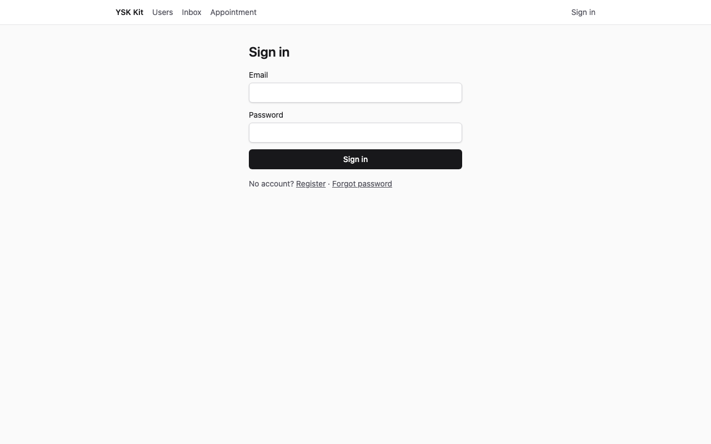
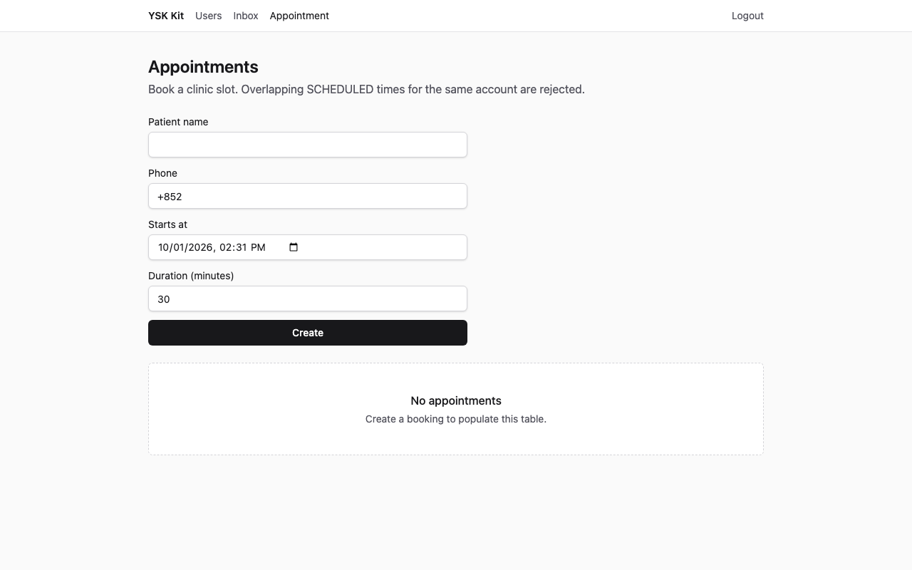
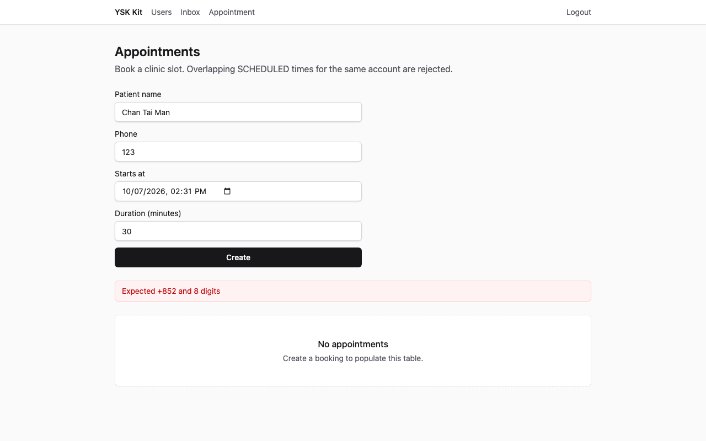
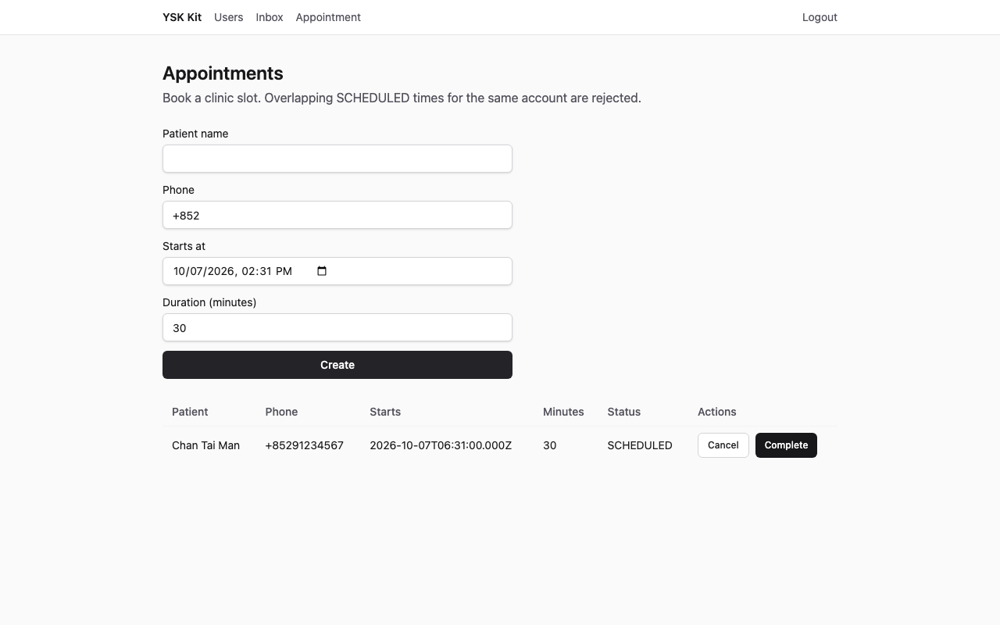
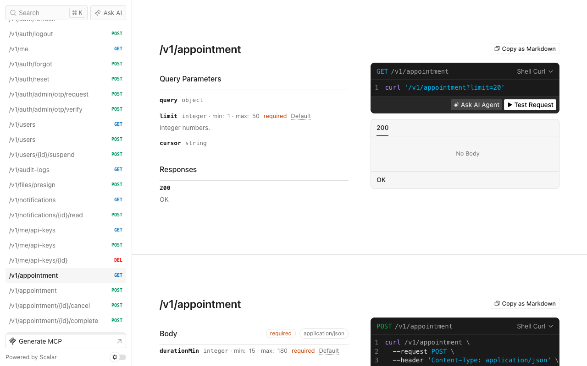

# Clinic booking

Language: [中文](tutorial.zh.md) · English

A thin SaaS product that books clinic or consultancy slots. This is the first worked example: one module, no extra capabilities, sqlite in CI, MySQL if you already run Compose.

Screenshots below are 1280×800, captured against an applied destination (API **13001**, web **15173**). Living-kit ports 3001 / 5173 stay free.

## 1. What you get

After you finish:

- A new product directory (not this kit) with identity, files, notifications, jobs, mail, API keys, crypto, and realtime from `--preset thin`.
- Hexagonal module `appointment` at `GET/POST /v1/appointment`, plus cancel and complete.
- Web page `/appointment`: list, create form, Cancel / Complete on `SCHEDULED` rows.
- Seed accounts `admin@ysk.hk` / `ysk-admin-dev` and `user@ysk.hk` / `ysk-user-dev`. Two future bookings belong to **admin** only.
- Memory-port tests for past starts, overlapping slots, and cancel rules.



**Expected:** the Sign in form with Email and Password. Title **Sign in**.

## 2. Who it is for, and how long it takes

Consultants, clinics, and any “one calendar of slots per signed-in practitioner”. About **15–25 minutes** the first time (scaffold + overlay + seed). Reading this page without applying is enough to see field names and envelopes.

## 3. Prerequisites

- **Node 24** and **pnpm 12**
- A checkout of this kit (the apply CLI lives here)
- Optional: Docker MySQL 8.4 if you override `--db mysql`

SQLite needs no Compose. The apply command defaults to sqlite from `spec.json`.

## 4. Why this flavor, preset, and database

| Choice | Value | Why |
|---|---|---|
| Flavor | `saas` | Web + API. Gateway / php-bridge / trading / static-web3 already have flavor manuals. |
| Preset | `thin` | Fifteen-minute path. No llm, billing, organizations, or push devices. |
| Database | sqlite in CI and in `spec.json` | No Docker. Production-like local work can pass `--db mysql`. |
| Admin app | off | This example is the practitioner web UI. |
| Mobile | off | Field work is a later example. |

Industry booking does **not** mount on the living kit API. Overlay files copy into the **destination** only.

## 5. Scaffold commands

From the kit checkout:

```bash
pnpm --filter @ysk/examples start apply clinic-booking --dest ~/Projects/my-clinic --yes
```

`--yes` is passed to `create-ysk-app` so agents and CI never wait for a TTY. Default destination (gitignored) is `examples/.runs/clinic-booking`. Replacing a previous run:

```bash
pnpm --filter @ysk/examples start apply clinic-booking --yes --force
```

Equivalent manual steps (MySQL):

```bash
pnpm --filter @ysk/create-app start my-clinic --preset thin --flavor saas --db mysql --no-admin --no-mobile --yes
cd my-clinic
pnpm install
cp .env.example .env
docker compose up -d mysql
pnpm db:generate && pnpm db:migrate && pnpm db:seed
pnpm ysk add module appointment --prisma --web
# then copy examples/clinic-booking/overlay/ over this tree
# replace model Appointment in apps/api/prisma/schema.prisma with the overlay fragment
pnpm db:generate && pnpm db:migrate && pnpm db:seed
pnpm gen:openapi
pnpm dev
```

SQLite skips Compose and uses `prisma db push` instead of `migrate dev` (migrate is interactive).

## 6. Modules and capabilities, and why that order

`spec.json` lists one module: `appointment` with `--prisma --web`. **Capabilities are empty.** Team and billing would come first on later examples (`team` then `billing`).

`ysk add module` writes the hexagonal slice and patches Express, Fastify, composition, SDK, web-sdk, and the web router (`/appointment`). The generator still uses `title` / `body`. The overlay then overwrites those files with clinic fields.

## 7. Data model

Prisma model `Appointment` (status is a `String`, not a TypeScript `enum`):

| Field | Type | Rule |
|---|---|---|
| `id` | UUID | Generated |
| `patientName` | string, 1–80 | Required |
| `phone` | `+852` and eight digits | `HkPhoneSchema` |
| `startsAt` | ISO datetime | Must be ≥ now at create |
| `durationMin` | int 15–180 | Default 30 |
| `status` | `SCHEDULED` \| `CANCELLED` \| `DONE` | `as const` + Zod in `@ysk/contracts` |
| `authorId` | UUID | Owner of the row (the signed-in user) |
| `createdAt` / `updatedAt` | datetime | Prisma |

Who can read/write: the signed-in user lists **their** rows. Cancel and complete require the same `authorId`. There is no staff role in this example.

## 8. Business rules

All of these live in `apps/api/src/modules/appointment/application/appointment-service.ts`.

1. `startsAt` earlier than `now` → `VALIDATION_FAILED` (HTTP 422).
2. A new `SCHEDULED` row whose half-open interval `[startsAt, startsAt + durationMin)` overlaps another `SCHEDULED` row for the **same** author → `CONFLICT` (HTTP 409). Adjacent slots (the next one starts exactly when the previous ends) are allowed.
3. The author may cancel their own `SCHEDULED` row → `CANCELLED`.
4. The author may complete their own `SCHEDULED` row → `DONE`.
5. `CANCELLED` and `DONE` cannot change again → `CONFLICT`.
6. Unknown id or another author’s row → `NOT_FOUND` (HTTP 404).
7. Missing session → `UNAUTHENTICATED` (HTTP 401).

The service accepts an optional `now` function so tests freeze the clock. Composition omits it and uses `new Date()`.

## 9. Overlay files versus the generator defaults

| Path | Generator | Overlay |
|---|---|---|
| `packages/contracts/src/dto/appointment.ts` | `title`, `body` | `patientName`, `phone`, `startsAt`, `durationMin`, `status` |
| `packages/contracts/src/api/appointment.ts` | list + create | list, create, cancel, complete |
| `application/appointment-service.ts` | passthrough | past / overlap / cancel / complete |
| `infra/*-appointment-repository.ts` | title/body rows | clinic fields + `getById` / `updateStatus` / `listScheduledForAuthor` |
| `infra/appointment-router.ts` | list + create | four handlers |
| `infra/appointment.test.ts` | create/list | rules + HTTP envelopes |
| `modules/appointment/prisma/appointment.prisma` | title/body | clinic model (also **replaces** the model in `schema.prisma`; merge will not update an existing model) |
| `packages/sdk` / `web-sdk` | list/create | + cancel/complete |
| `apps/web/.../appointment-page.tsx` | title/body form | clinic form, EmptyState, Cancel |
| `apps/api/src/infra/seed.ts` | two users | two users + two admin bookings |

## 10. Seed data

`pnpm db:seed` upserts:

| Email | Password | Role | Appointments |
|---|---|---|---|
| `admin@ysk.hk` | `ysk-admin-dev` | ADMIN | Wong Mei Ling (+24 h, 30 min), Lee Ka Ming (+48 h, 45 min), both `SCHEDULED` |
| `user@ysk.hk` | `ysk-user-dev` | USER | none |

Screenshots of the empty list sign in as **user@ysk.hk** so the table is empty even after seed.

## 11. Start and sign in

```bash
cd ~/Projects/my-clinic   # or examples/.runs/clinic-booking
pnpm dev
```

| Surface | URL |
|---|---|
| API | http://localhost:3001 |
| Web | http://localhost:5173 |
| Scalar | http://localhost:3001/docs |

Open http://localhost:5173/login.

**Expected:** heading **Sign in**, fields Email and Password, button **Sign in**.

Sign in as `user@ysk.hk` / `ysk-user-dev`. The login page navigates to `/users`. Open **Appointment** in the nav (path `/appointment`).

## 12. UI walkthrough

### Empty list



**Expected:** heading **Appointments**, the create form, and EmptyState title **No appointments** with description “Create a booking to populate this table.”

### Invalid phone

Keep a future **Starts at**. Set Patient name to `Chan Tai Man`, Phone to `123`, Duration `30`. Click **Create**.



**Expected:** an error banner (role `alert`) with **Expected +852 and 8 digits**. The table stays empty.

### Created row

Set Phone to `+85291234567`. Click **Create**.



**Expected:** a table row for **Chan Tai Man**, phone `+85291234567`, status `SCHEDULED`, buttons **Cancel** and **Complete**. EmptyState is gone. Form patient name is cleared.

Cancel on that row sets status to `CANCELLED` and hides the buttons. Completing a `SCHEDULED` row sets `DONE`. A second booking that overlaps the remaining `SCHEDULED` time shows the service message “That slot overlaps an existing appointment”.

## 13. HTTP walkthrough

All JSON routes use `{ ok: true, data }` / `{ ok: false, error }`. Register or login first; send `Authorization: Bearer <accessToken>` and `x-ysk-platform: web`.

### Success — `POST /v1/appointment`

```bash
curl -sS http://localhost:3001/v1/appointment \
  -H 'content-type: application/json' \
  -H 'x-ysk-platform: web' \
  -H "authorization: Bearer $TOKEN" \
  -d '{"patientName":"Chan Tai Man","phone":"+85291234567","startsAt":"2035-03-01T02:00:00.000Z","durationMin":30}'
```

**Expected** (id and timestamps vary; see `expected/create-ok.json`):

```json
{
  "ok": true,
  "data": {
    "patientName": "Chan Tai Man",
    "phone": "+85291234567",
    "durationMin": 30,
    "status": "SCHEDULED"
  }
}
```

HTTP status **201**.

### Past start

Use `"startsAt":"2020-01-01T02:00:00.000Z"`.

**Expected** (`expected/create-past.json`): HTTP **422**

```json
{ "ok": false, "error": { "code": "VALIDATION_FAILED" } }
```

### Overlap

Create the 02:00 slot, then POST another at 02:15 with duration 30.

**Expected** (`expected/overlap.json`): HTTP **409**

```json
{ "ok": false, "error": { "code": "CONFLICT" } }
```

### No session

Omit the Authorization header.

**Expected** (`expected/unauthenticated.json`): HTTP **401**

```json
{ "ok": false, "error": { "code": "UNAUTHENTICATED" } }
```

Cancel: `POST /v1/appointment/:id/cancel` with `{}`. Complete: `POST /v1/appointment/:id/complete`.

## 14. Scalar `/docs`

Open http://localhost:3001/docs (or port 13001 when using `capture`).



**Expected:** Scalar API reference HTML. `GET /openapi.json` lists `/v1/appointment`, `/v1/appointment/{id}/cancel`, and `/v1/appointment/{id}/complete`. After `pnpm gen:openapi` the destination `docs/openapi.yaml` contains the same paths.

## 15. Verify commands

Inside the destination:

```bash
pnpm layers && pnpm typecheck && pnpm test && pnpm gen:openapi && pnpm ysk check agent
```

**Expected:** all green. Appointment tests cover past starts, overlap, adjacent slots, cancel/complete, and the four HTTP envelopes above. `ysk check agent` reports `ysk check agent: ok` (no TypeScript `enum`, no Prisma in web, no raw `fetch`).

The apply CLI already runs that bar unless you pass `--skip-verify`.

## 16. Out of scope

- Mounting `appointment` on the living kit
- Staff / multi-practitioner calendars, Google Calendar, SMS reminders
- `ysk add team` or billing (see [membership-club](../membership-club/tutorial.md))
- Live Stripe, Twilio, FCM, Redis, Jaeger, Grafana
- Visual screenshot diffs in CI (PNG files are committed; CI applies sqlite and runs tests)

## 17. Next example

CRM contacts and follow-ups (`crm-contacts`) is the next worked system: [tutorial](../crm-contacts/tutorial.md). The full catalogue is in the [examples index](../README.md).
