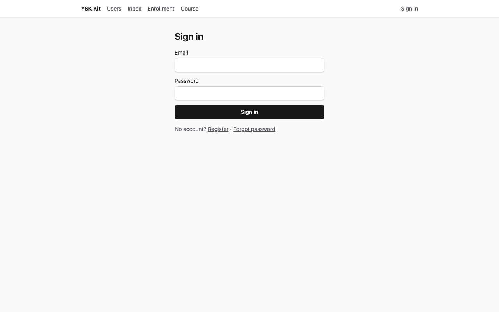
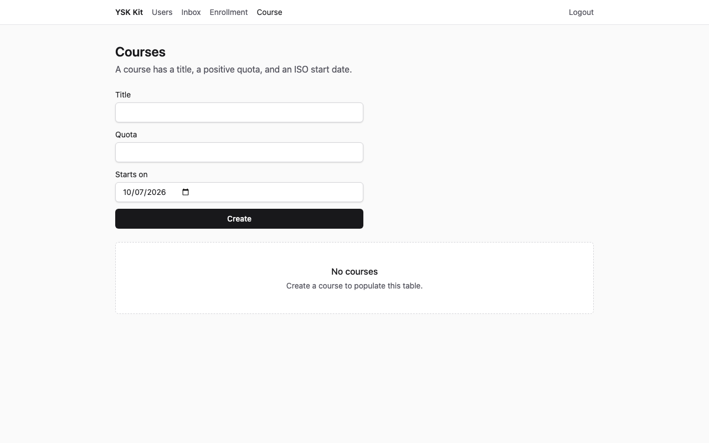
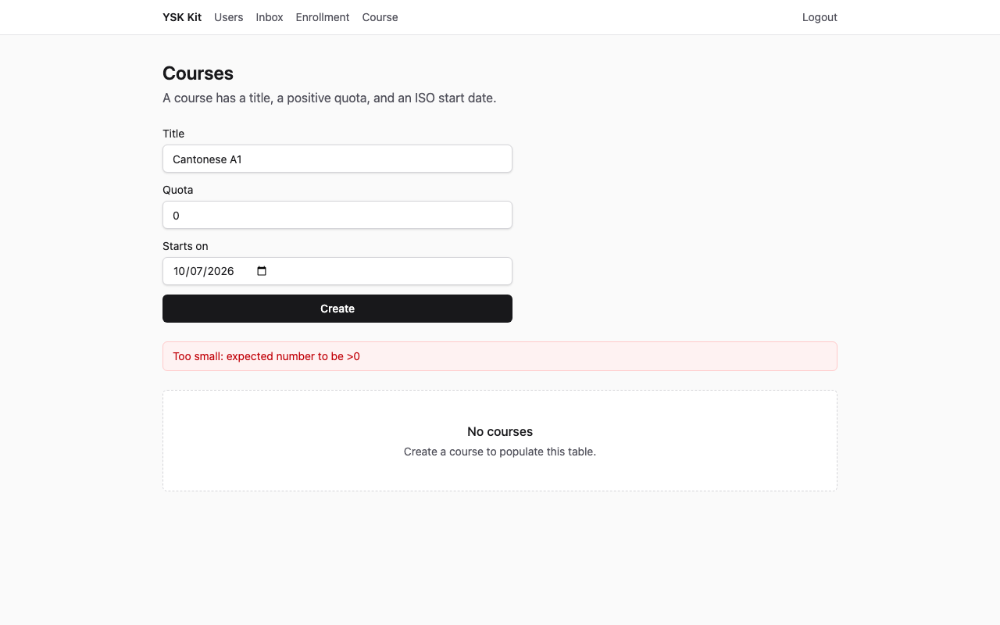
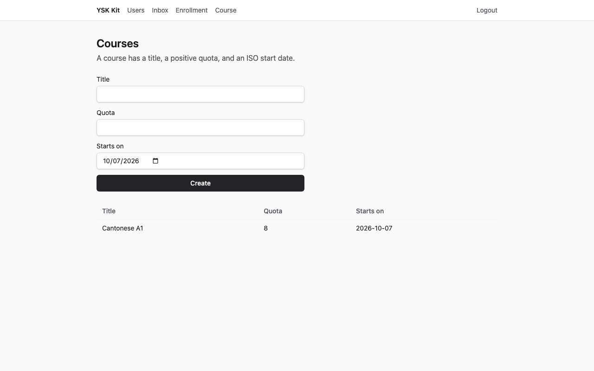
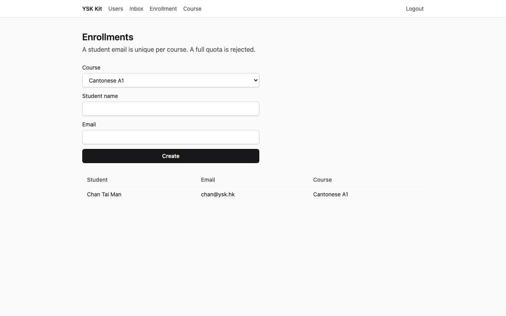
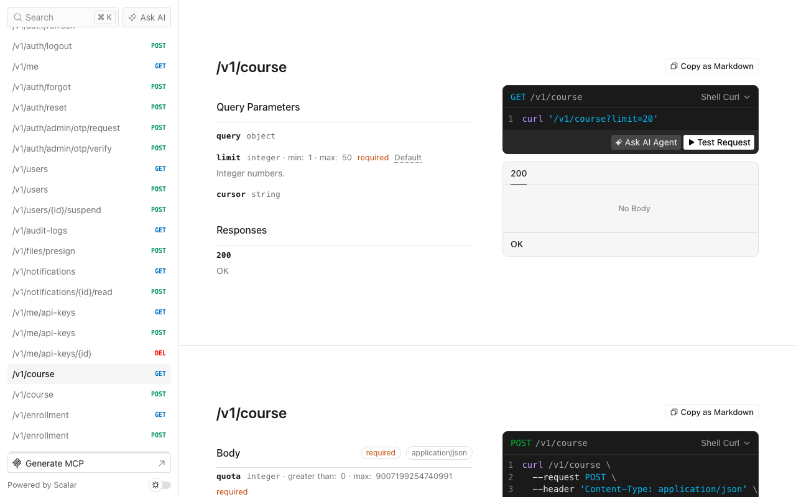

# Course enrolment

Language: [中文](tutorial.zh.md) · English

A thin SaaS product that publishes courses and enrols students against a quota. Two hexagonal modules, no extra capabilities.

Screenshots below are 1280×800, captured against an applied destination (API **13001**, web **15173**). Living-kit ports 3001 / 5173 stay free.

## 1. What you get

After you finish:

- A new product directory (not this kit) with identity, files, notifications, jobs, mail, API keys, crypto, and realtime from `--preset thin`.
- Module `course` at `GET/POST /v1/course`.
- Module `enrollment` at `GET/POST /v1/enrollment`. An enrolment must point at a course the author owns, and the course must still have a free seat.
- Web pages `/course` and `/enrollment` (nav labels **Course** and **Enrollment**).
- Seed accounts `admin@ysk.hk` / `ysk-admin-dev` and `user@ysk.hk` / `ysk-user-dev`. One full admin course; the user list starts empty.
- Memory-port tests for duplicate email, a full quota, and a missing course.



**Expected:** the Sign in form with Email and Password. Title **Sign in**.

## 2. Who it is for, and how long it takes

Language schools, workshops, and any “named seats on a dated class”. About **20–30 minutes** the first time (scaffold + overlay + seed). Reading this page without applying is enough to see field names and envelopes.

## 3. Prerequisites

- **Node 24** and **pnpm 12**
- A checkout of this kit (the apply CLI lives here)
- Optional: Docker MySQL 8.4 if you override `--db mysql`

SQLite needs no Compose. The apply command defaults to sqlite from `spec.json`.

## 4. Why this flavor, preset, and database

| Choice | Value | Why |
|---|---|---|
| Flavor | `saas` | Web + API. Gateway / php-bridge / trading / static-web3 already have flavor manuals. |
| Preset | `thin` | Fifteen-minute path. No llm, billing, organizations, or push devices. |
| Database | sqlite in CI and in `spec.json` | No Docker. Production-like local work can pass `--db mysql`. |
| Admin app | off | This example is the teacher web UI. |
| Mobile | off | Field work is a later example. |

Industry enrolment does **not** mount on the living kit API. Overlay files copy into the **destination** only.

## 5. Scaffold commands

From the kit checkout:

```bash
pnpm --filter @ysk-kit/examples start apply course-enrollment --dest ~/Projects/my-courses --yes
```

`--yes` is passed to `create-ysk-app` so agents and CI never wait for a TTY. Default destination (gitignored) is `examples/.runs/course-enrollment`. Replacing a previous run:

```bash
pnpm --filter @ysk-kit/examples start apply course-enrollment --yes --force
```

Equivalent manual steps (sqlite): `create-ysk-app` thin saas sqlite `--no-admin --no-mobile --yes`, then `ysk add module course --prisma --web`, `ysk add module enrollment --prisma --web`, copy this overlay, replace Prisma models `Course` and `Enrollment`, `prisma db push`, seed.

## 6. Modules and capabilities, and why that order

`spec.json` lists `course` then `enrollment`. **Capabilities are empty.** Add the parent module first so the child Prisma fragment can declare `course Course @relation(...)`.

`examples/course-enrollment/patches.json` rewires the memory harness so both services share one in-memory course repository (HTTP tests create a course then an enrolment). The child is added second, so the generated `enrollmentService` line sits **above** `courseService` after `userService`. The patch wraps those two lines in an IIFE that shares `courseRepo`.

## 7. Data model

**Course** (quota is a positive integer, not a TypeScript `enum`):

| Field | Type | Rule |
|---|---|---|
| `id` | UUID | Generated |
| `title` | string, 1–80 | Required |
| `quota` | int `> 0` | `z.number().int().positive()` |
| `startsOn` | ISO date | `z.iso.date()` (`YYYY-MM-DD`) |
| `authorId` | UUID | Owner of the row (the signed-in user) |
| `createdAt` / `updatedAt` | datetime | Prisma |

**Enrollment:** `courseId`, `studentName` (1–80), `email`. Prisma `@@unique([courseId, email])`.

Who can read/write: the signed-in user lists **their** rows. Enrolment requires the same `authorId` as the course.

## 8. Business rules

All enrolment rules live in `apps/api/src/modules/enrollment/application/enrollment-service.ts`. `createEnrollmentService` takes a **single** repository argument.

1. Quota `0` (or any non-positive integer) on `POST /v1/course` → `VALIDATION_FAILED` (HTTP 422, Zod `positive()`).
2. Enrolment whose `courseId` is missing or owned by someone else → `NOT_FOUND` (HTTP 404).
3. Same `courseId` + `email` → `CONFLICT` (HTTP 409).
4. `countForCourse(courseId) >= quota` → `CONFLICT` (HTTP 409).
5. Missing session → `UNAUTHENTICATED` (HTTP 401).

The child repository exposes `getCourse(id) → { id, authorId, quota } | null`, `countForCourse(courseId)`, and `findByCourseEmail(courseId, email)`. The Prisma enrolment adapter queries `prisma.course`.

## 9. Overlay files versus the generator defaults

| Path | Generator | Overlay |
|---|---|---|
| `packages/contracts/src/dto/course.ts` | `title`, `body` | `title`, `quota`, `startsOn` |
| `packages/contracts/src/dto/enrollment.ts` | `title`, `body` | `courseId`, `studentName`, `email` |
| `application/enrollment-service.ts` | passthrough | missing course / duplicate email / full quota |
| `infra/*-enrollment-repository.ts` | title/body rows | `getCourse` / `countForCourse` / `findByCourseEmail` |
| `modules/course/prisma/course.prisma` | title/body | course model + `enrollments` relation |
| `modules/enrollment/prisma/enrollment.prisma` | title/body | enrolment model + `@@unique([courseId, email])` |
| `apps/web/.../course-page.tsx` | title/body form | Title, Quota, Starts on, EmptyState **No courses** |
| `apps/web/.../enrollment-page.tsx` | title/body form | Course select, Student name, Email |
| `apps/api/src/infra/seed.ts` | two users | two users + one full admin course |

`app.ts` and `router.tsx` stay as the CLI patched them.

## 10. Seed data

`pnpm db:seed` upserts:

| Email | Password | Role | Courses |
|---|---|---|---|
| `admin@ysk.hk` | `ysk-admin-dev` | ADMIN | Admin briefing, quota `1`, plus one enrolment (`Lee Ka Ming` / `lee@ysk.hk`) so the class is full |
| `user@ysk.hk` | `ysk-user-dev` | USER | none |

Screenshots of the empty list sign in as **user@ysk.hk** so the table is empty even after seed.

## 11. Start and sign in

```bash
cd ~/Projects/my-courses   # or examples/.runs/course-enrollment
pnpm dev
```

| Surface | URL |
|---|---|
| API | http://localhost:3001 |
| Web | http://localhost:5173 |
| Scalar | http://localhost:3001/docs |

Open http://localhost:5173/login.

**Expected:** heading **Sign in**, fields Email and Password, button **Sign in**.

Sign in as `user@ysk.hk` / `ysk-user-dev`. The login page navigates to `/users`. Open **Course** in the nav (path `/course`).

## 12. UI walkthrough

### Empty list



**Expected:** heading **Courses**, the create form, and EmptyState title **No courses**.

### Invalid quota

Set Title to `Cantonese A1`, Quota to `0`, Starts on to a future date. Click **Create**.



**Expected:** an error banner (role `alert`) with a Zod positive-integer message (`Too small: expected number to be >0`). The table stays empty.

### Created row

Set Quota to `8`. Click **Create**.



**Expected:** a table row for **Cantonese A1**, quota `8`. EmptyState is gone.

Open **Enrollment**, choose Course **Cantonese A1**, Student name `Chan Tai Man`, Email `chan@ysk.hk`, Create.



**Expected:** a table row for `chan@ysk.hk`.

## 13. HTTP walkthrough

All JSON routes use `{ ok: true, data }` / `{ ok: false, error }`. Register or login first; send `Authorization: Bearer <accessToken>` and `x-ysk-platform: web`.

### Success — `POST /v1/course`

```bash
curl -sS http://localhost:3001/v1/course \
  -H 'content-type: application/json' \
  -H 'x-ysk-platform: web' \
  -H "authorization: Bearer $TOKEN" \
  -d '{"title":"Cantonese A1","quota":8,"startsOn":"2035-03-01"}'
```

**Expected** (id and timestamps vary; see `expected/create-ok.json`):

```json
{
  "ok": true,
  "data": {
    "title": "Cantonese A1",
    "quota": 8,
    "startsOn": "2035-03-01"
  }
}
```

HTTP status **201**.

### Invalid quota

Use `"quota":0`.

**Expected** (`expected/create-invalid.json`): HTTP **422**

```json
{ "ok": false, "error": { "code": "VALIDATION_FAILED" } }
```

### Duplicate email

Enrol `chan@ysk.hk` on the same course twice.

**Expected** (`expected/duplicate.json`): HTTP **409**

```json
{ "ok": false, "error": { "code": "CONFLICT" } }
```

A course whose enrolment count is already at `quota` returns the same `CONFLICT` envelope (`expected/enrollment-full.json`).

### Missing course

`POST /v1/enrollment` with an unknown `courseId`.

**Expected** (`expected/enrollment-missing.json`): HTTP **404**

```json
{ "ok": false, "error": { "code": "NOT_FOUND" } }
```

### No session

Omit the Authorization header.

**Expected** (`expected/unauthenticated.json`): HTTP **401**

```json
{ "ok": false, "error": { "code": "UNAUTHENTICATED" } }
```

## 14. Scalar `/docs`

Open http://localhost:3001/docs (or port 13001 when using `capture`).



**Expected:** Scalar API reference HTML. `GET /openapi.json` lists `/v1/course` and `/v1/enrollment`. After `pnpm gen:openapi` the destination `docs/openapi.yaml` contains the same paths.

## 15. Verify commands

Inside the destination:

```bash
pnpm layers && pnpm typecheck && pnpm test && pnpm gen:openapi && pnpm ysk check agent
```

**Expected:** all green. Course tests cover quota `0`, duplicate email, a full class, a missing course, and the HTTP envelopes above. `ysk check agent` reports `ysk check agent: ok` (no TypeScript `enum`, no Prisma in web, no raw `fetch`).

The apply CLI already runs that bar unless you pass `--skip-verify`.

## 16. Out of scope

- Mounting `course` or `enrollment` on the living kit
- Waitlists, payments, or attendance
- `ysk add team` or billing (see membership-club when it ships)
- Live Stripe, Twilio, FCM, Redis, Jaeger, Grafana
- Visual screenshot diffs in CI (PNG files are documentation; CI applies sqlite and runs tests)

## 17. Next example

Quotes (`invoice-quotes`) is the next worked system in the [examples index](../README.md).
