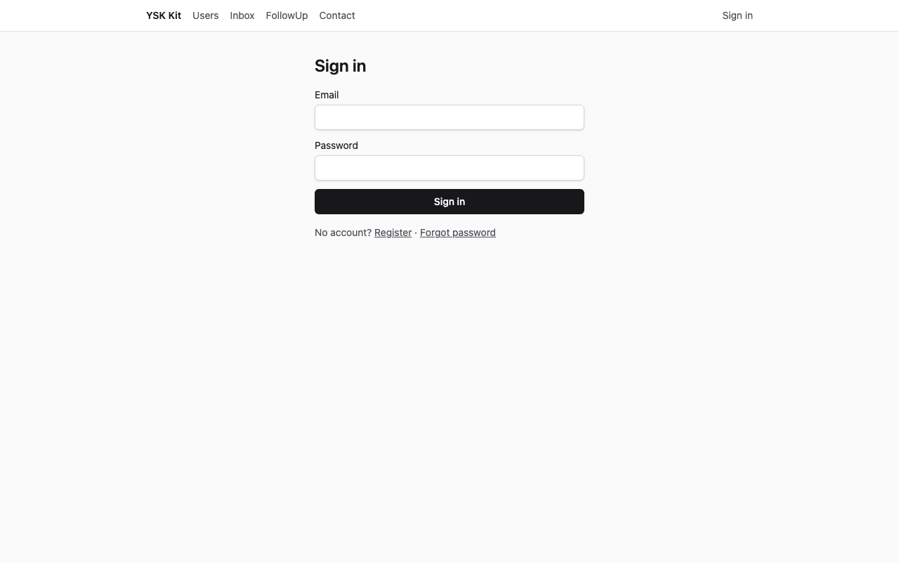
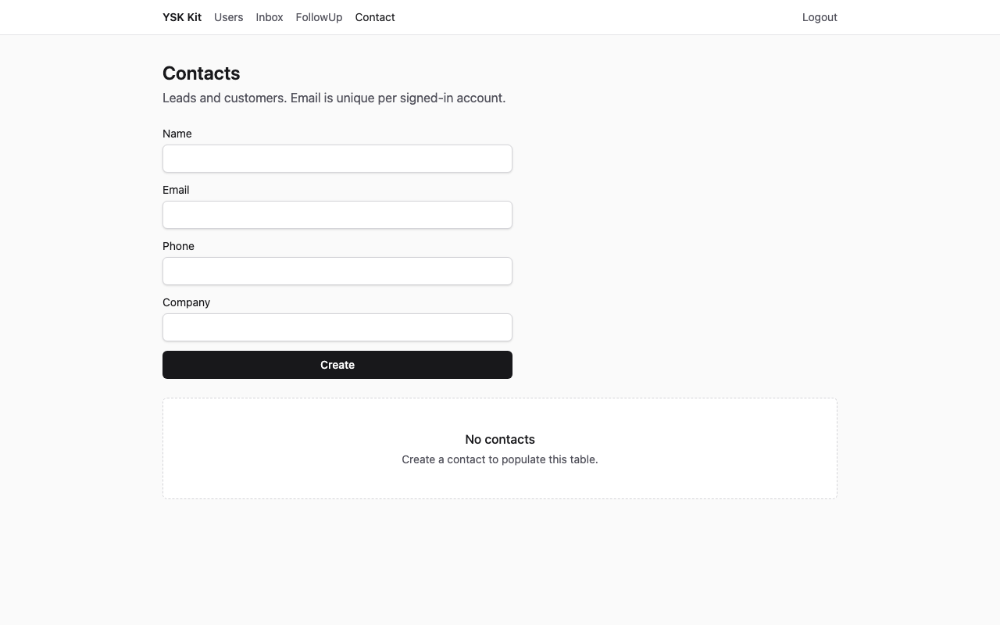
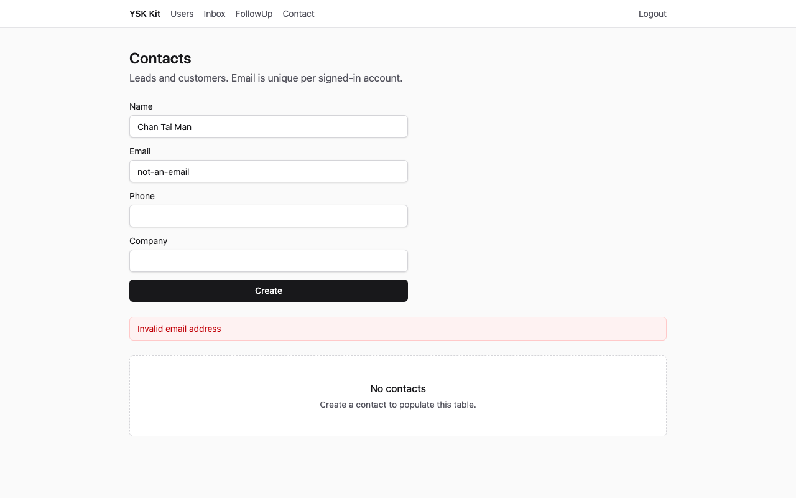
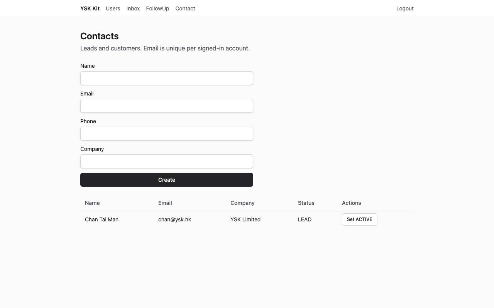
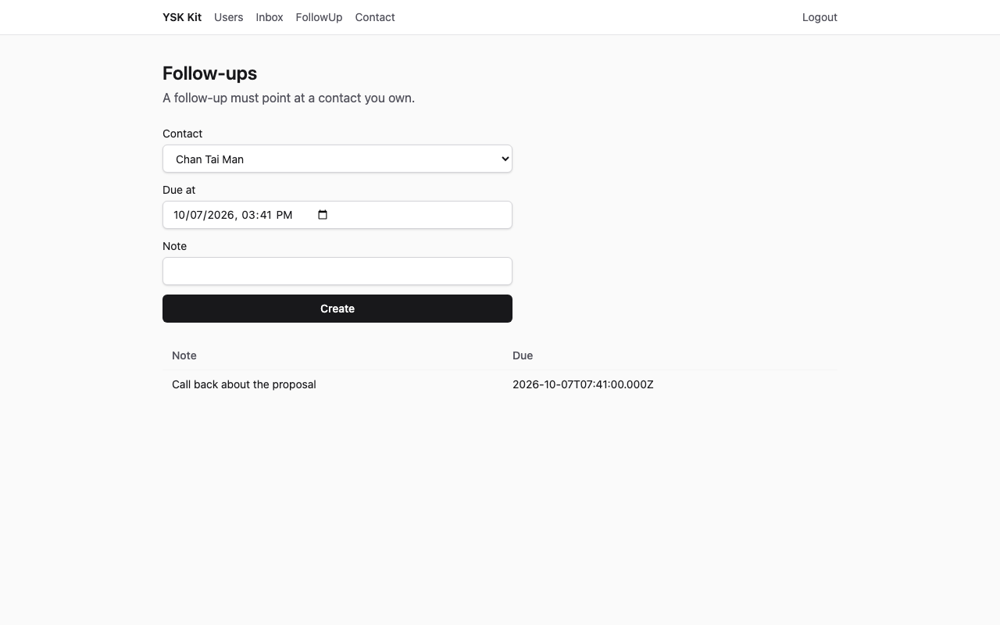
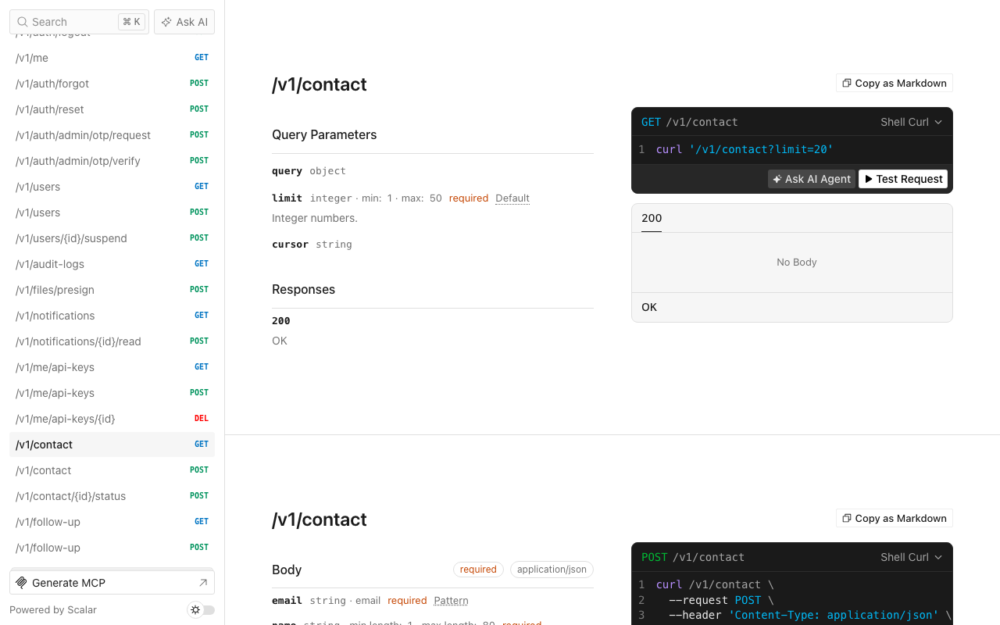

# CRM 客戶與跟進

語言：[English](tutorial.md) · 中文

精簡 SaaS 產品，存放銷售聯絡人與跟進備註。兩個六角形模組，沒有額外能力。

以下截圖為 1280×800，對已套用的目的地擷取（API **13001**，web **15173**）。

## 1. 完成後你會得到甚麼

- 新產品目錄，含 `--preset thin` 的身份、檔案、通知、工作、郵件、API 金鑰、加密與即時通道。
- 模組 `contact`：`GET/POST /v1/contact` 及 `POST /v1/contact/:id/status`。
- 模組 `follow-up`：`GET/POST /v1/follow-up`。跟進必須指向作者擁有的聯絡人。
- 網頁 `/contact` 與 `/follow-up`（導航文字 **Contact** 與 **FollowUp**）。
- Seed 帳戶 `admin@ysk.hk`／`ysk-admin-dev` 與 `user@ysk.hk`／`ysk-user-dev`。管理員有一筆 LEAD；使用者列表由空白開始。



**預期效果：**登入表單。標題 **Sign in**。

## 2. 誰適用、預計時間

B2B 銷售，以及任何「具名人物加下一步行動」。第一次約 **20–30 分鐘**。

## 3. 前置

- **Node 24** 與 **pnpm 12**
- 此 kit 的 checkout
- 可選：若改 `--db mysql`，需要 Docker MySQL 8.4

## 4. 為甚麼這個 flavor／preset／資料庫

| 選擇 | 值 | 原因 |
|---|---|---|
| Flavor | `saas` | Web + API |
| Preset | `thin` | 十五分鐘路徑。沒有 llm、billing、組織或 push |
| 資料庫 | `spec.json` 為 sqlite | 不需 Docker。Compose 可傳 `--db mysql` |
| Admin／mobile | 關閉 | 桌面 web 已足夠 |

行業 CRM **不會**掛在 living kit API。

## 5. 開倉命令

```bash
pnpm --filter @ysk-kit/examples start apply crm-contacts --dest ~/Projects/my-crm --yes
```

預設目的地（已 gitignore）：`examples/.runs/crm-contacts`。覆蓋上一次結果請加 `--force`。

手動（sqlite）：`create-ysk-app` thin saas sqlite `--no-admin --no-mobile --yes`，然後 `ysk add module contact --prisma --web`、`ysk add module follow-up --prisma --web`，複製此 overlay，替換 Prisma 模型 `Contact` 與 `FollowUp`，`prisma db push`，seed。

## 6. 加哪些 module／capability，為甚麼這個順序

`spec.json` 先 `contact` 再 `follow-up`。能力清單空白。先加父模組，子模組的 Prisma 片段才能寫 `contact Contact @relation(...)`。

`examples/crm-contacts/patches.json` 會改 memory 測試組裝，讓兩個服務共用同一個記憶體聯絡人倉庫（HTTP 測試先建聯絡人再建跟進）。

## 7. 資料模型

**Contact**（狀態是 `String`，不是 TypeScript `enum`）：

| 欄位 | 類型 | 規則 |
|---|---|---|
| `name` | 1–80 | 必填 |
| `email` | 電郵 | 每個 `authorId` 唯一 |
| `phone`／`company` | 可選 | Prisma 可空 |
| `status` | `LEAD` \| `ACTIVE` \| `CHURNED` | 建立時為 `LEAD` |

**Follow-up：**`contactId`、`dueAt`（ISO 日期時間）、`note`（1–500）。

誰可讀寫：已登入使用者列出**自己的**列。

## 8. 業務規則

1. 同一作者重複電郵 → `CONFLICT`（HTTP 409）。
2. 非法電郵 → `VALIDATION_FAILED`（HTTP 422）。
3. 跟進的 `contactId` 不存在或不屬作者 → `NOT_FOUND`（HTTP 404）。
4. 沒有工作階段 → `UNAUTHENTICATED`（HTTP 401）。
5. `POST /v1/contact/:id/status` 讓擁有人改 `LEAD`／`ACTIVE`／`CHURNED`。

## 9. overlay 把哪些檔換成填好的版本

產生器仍用 `title`／`body`。overlay 覆寫 DTO、合約、服務、倉庫、HTTP 測試、Prisma 片段、SDK、web-sdk、兩個頁面與 seed。`app.ts` 與 `router.tsx` 維持 CLI 修補結果。

## 10. seed 會插入甚麼

| 電郵 | 密碼 | 角色 | 聯絡人 |
|---|---|---|---|
| `admin@ysk.hk` | `ysk-admin-dev` | ADMIN | Wong Mei Ling，`wong@ysk.hk`，`LEAD` |
| `user@ysk.hk` | `ysk-user-dev` | USER | 沒有 |

## 11. 啟動與登入

```bash
cd ~/Projects/my-crm
pnpm dev
```

開啟 http://localhost:5173/login。以 `user@ysk.hk`／`ysk-user-dev` 登入。登入後到 `/users`。在導航開啟 **Contact**。

## 12. UI 逐步



**預期效果：**標題 **Contacts**，空白狀態 **No contacts**。

輸入姓名 `Chan Tai Man`、電郵 `not-an-email`，然後 Create。



**預期效果：**警告橫額出現 Zod 電郵訊息。

把電郵改成 `chan@ysk.hk`，電話 `+85291234567`，公司 `YSK Limited`，Create。



**預期效果：**一列 Chan Tai Man，狀態 `LEAD`。

開啟 **FollowUp**，Contact 選 **Chan Tai Man**，備註 `Call back about the proposal`，Create。



**預期效果：**跟進表出現該備註。

## 13. HTTP 逐步

基底 URL http://localhost:3001（擷取時為 **13001**）。`POST /v1/auth/login` 取得 Bearer。

**預期效果**（`expected/create-ok.json`）：HTTP **201**

```json
{
  "ok": true,
  "data": {
    "name": "Chan Tai Man",
    "email": "chan@ysk.hk",
    "phone": "+85291234567",
    "company": "YSK Limited",
    "status": "LEAD"
  }
}
```

非法電郵 → HTTP **422** `{ "ok": false, "error": { "code": "VALIDATION_FAILED" } }`。

同一電郵再 POST → HTTP **409** `CONFLICT`。

未知 `contactId` 的跟進 → HTTP **404** `NOT_FOUND`。

沒有 `Authorization` → HTTP **401** `UNAUTHENTICATED`。

## 14. Scalar `/docs`



**預期效果：**Scalar 列出 `GET`／`POST /v1/contact` 與 `POST /v1/contact/{id}/status`。`GET /openapi.json` 亦列出 `/v1/follow-up`。

## 15. 驗證命令

在目的地內：

```bash
pnpm layers && pnpm typecheck && pnpm test && pnpm gen:openapi && pnpm ysk check agent
```

**預期效果：**全部綠色。聯絡人測試涵蓋重複電郵、跟進擁有權，以及上述 HTTP envelope。

## 16. 本例不做甚麼

- 把 `contact` 掛進 living kit
- 銷售漏斗、評分或發信
- `ysk add team`（見 helpdesk-tickets）

## 17. 下一例

進銷存（`inventory-stock`）是 [實例目錄](../README.zh.md) 的下一個系統。
