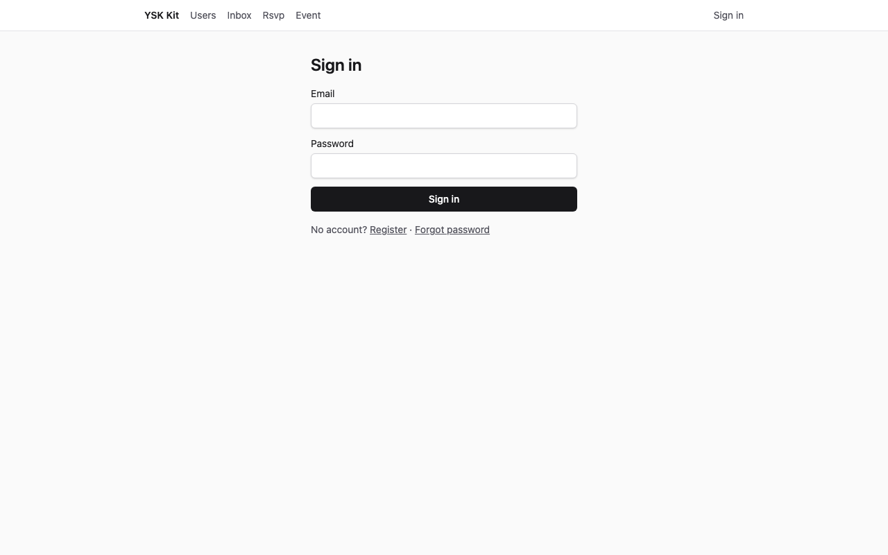
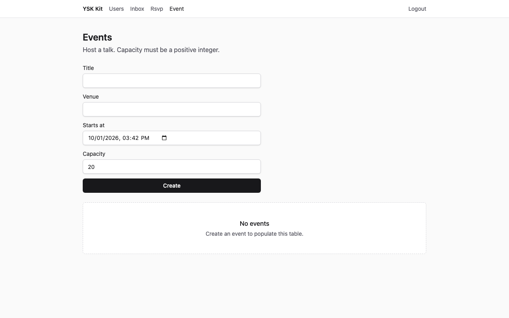
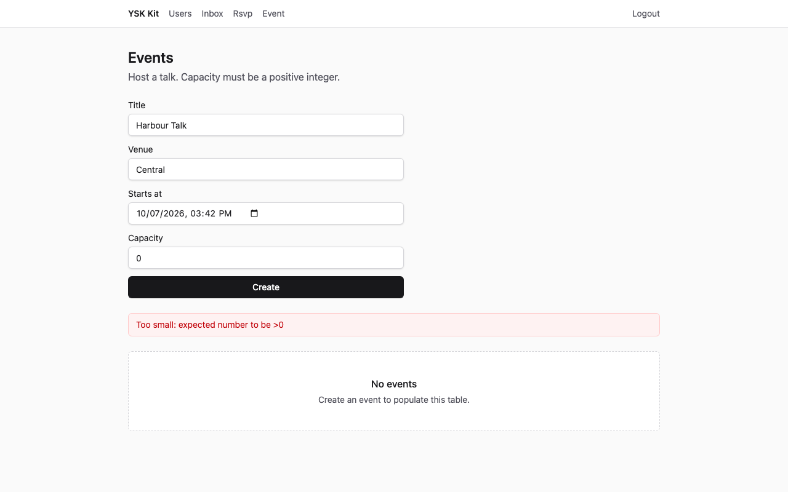
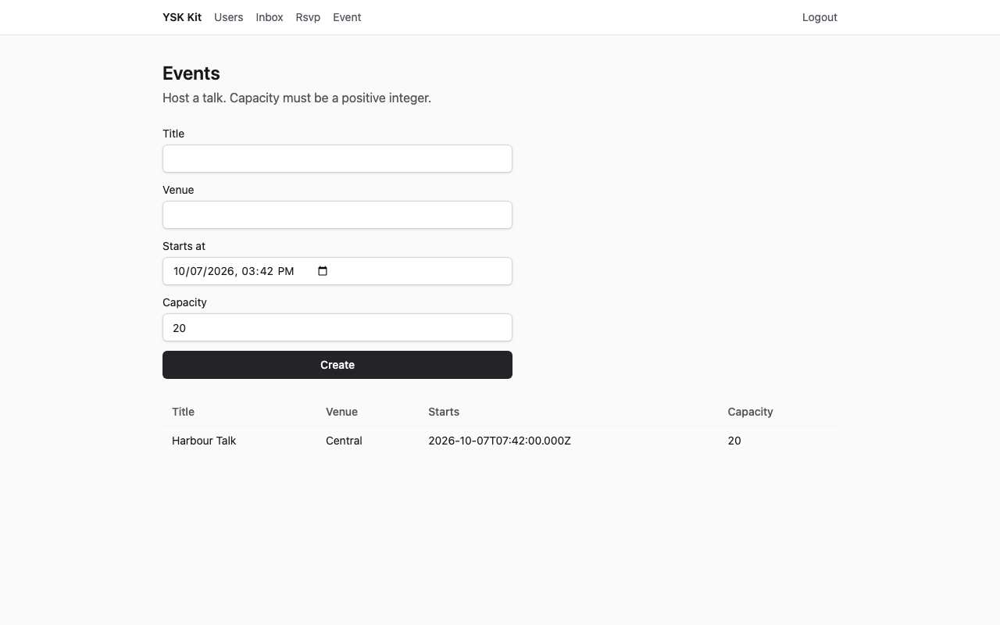
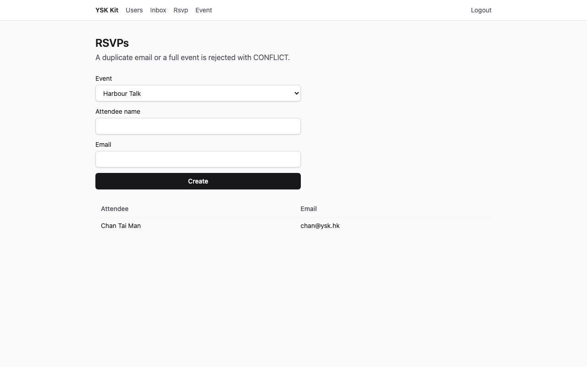
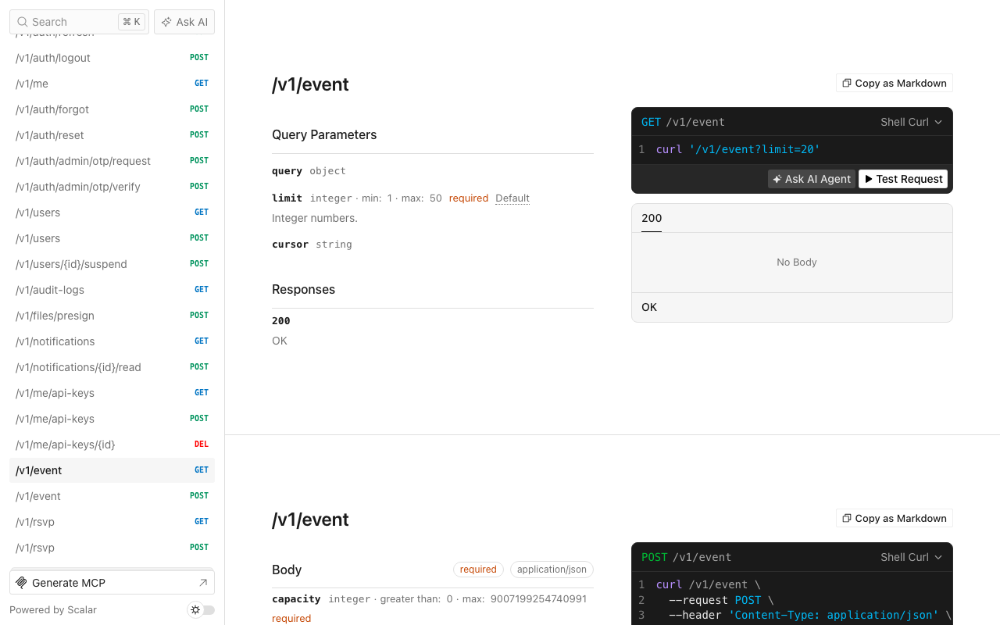

# 活動報名

Language: [English](tutorial.md) · 中文

精簡 SaaS 產品，用來舉辦活動並記錄報名。兩個六角形模組，沒有額外能力。

以下截圖為 1280×800，對已套用的目的地擷取（API **13001**，web **15173**）。

## 1. 完成後你會得到甚麼

- 新產品目錄，含 `--preset thin` 的身份、檔案、通知、工作、郵件、API 金鑰、加密與即時通道。
- 模組 `event`：`GET/POST /v1/event`。
- 模組 `rsvp`：`GET/POST /v1/rsvp`。報名必須指向已存在的活動。同一活動重複電郵，或已滿座，都是 `CONFLICT`。
- 網頁 `/event` 與 `/rsvp`（導航文字 **Event** 與 **Rsvp**）。
- Seed 帳戶 `admin@ysk.hk`／`ysk-admin-dev` 與 `user@ysk.hk`／`ysk-user-dev`。管理員有一場活動；使用者列表由空白開始。



**預期效果：**登入表單。標題 **Sign in**。

## 2. 誰適用、預計時間

講座、聚會，以及任何「具名活動加來賓名單」。第一次約 **20–30 分鐘**。

## 3. 前置

- **Node 24** 與 **pnpm 12**
- 此 kit 的 checkout
- 可選：若改 `--db mysql`，需要 Docker MySQL 8.4

## 4. 為甚麼這個 flavor／preset／資料庫

| 選擇 | 值 | 原因 |
|---|---|---|
| Flavor | `saas` | Web + API |
| Preset | `thin` | 十五分鐘路徑。沒有 llm、billing、組織或 push |
| 資料庫 | `spec.json` 為 sqlite | 不需 Docker。Compose 可傳 `--db mysql` |
| Admin／mobile | 關閉 | 桌面 web 已足夠 |

行業活動**不會**掛在 living kit API。

## 5. 開倉命令

```bash
pnpm --filter @ysk-kit/examples start apply event-rsvp --dest ~/Projects/my-events --yes
```

預設目的地（已 gitignore）：`examples/.runs/event-rsvp`。覆蓋上一次結果請加 `--force`。

手動（sqlite）：`create-ysk-app` thin saas sqlite `--no-admin --no-mobile --yes`，然後 `ysk add module event --prisma --web`、`ysk add module rsvp --prisma --web`，複製此 overlay，替換 Prisma 模型 `Event` 與 `Rsvp`，`prisma db push`，seed。

## 6. 加哪些 module／capability，為甚麼這個順序

`spec.json` 先 `event` 再 `rsvp`。能力清單空白。先加父模組，子模組的 Prisma 片段才能寫 `event Event @relation(...)`。

`examples/event-rsvp/patches.json` 會改 memory 測試組裝，讓兩個服務共用同一個記憶體活動倉庫（產生器把 `rsvpService` 插在 `eventService` 之上；patch 用 `eventRepo` 包起來）。

## 7. 資料模型

**Event**（沒有 TypeScript `enum`）：

| 欄位 | 類型 | 規則 |
|---|---|---|
| `title` | 1–80 | 必填 |
| `venue` | 1–80 | 必填 |
| `startsAt` | ISO 日期時間 | 必填 |
| `capacity` | 正整數 | 必須 ≥ 1 |

**RSVP：**`eventId`、`attendeeName`（1–80）、`email`。唯一約束 `[eventId, email]`。

誰可讀寫：已登入使用者列出**自己的**列。

## 8. 業務規則

1. 名額 `0` 或非正整數 → `VALIDATION_FAILED`（HTTP 422）。
2. 報名的 `eventId` 不存在 → `NOT_FOUND`（HTTP 404）。
3. 同一 `eventId` + `email` 再來一次 → `CONFLICT`（HTTP 409）。
4. 報名人數已達 `capacity` → `CONFLICT`（HTTP 409）。
5. 沒有工作階段 → `UNAUTHENTICATED`（HTTP 401）。

子倉庫方法：`getEvent`、`countForEvent`、`findByEventEmail`。

## 9. overlay 把哪些檔換成填好的版本

產生器仍用 `title`／`body`。overlay 覆寫 DTO、合約、服務、倉庫、HTTP 測試、Prisma 片段、SDK、web-sdk、兩個頁面與 seed。`app.ts` 與 `router.tsx` 維持 CLI 修補結果。`patches.json` 讓 memory harness 共用 `eventRepo`。

## 10. seed 會插入甚麼

| 電郵 | 密碼 | 角色 | 活動 |
|---|---|---|---|
| `admin@ysk.hk` | `ysk-admin-dev` | ADMIN | Town Hall，Admiralty，名額 50 |
| `user@ysk.hk` | `ysk-user-dev` | USER | 沒有 |

## 11. 啟動與登入

```bash
cd ~/Projects/my-events
pnpm dev
```

開啟 http://localhost:5173/login。以 `user@ysk.hk`／`ysk-user-dev` 登入。登入後到 `/users`。在導航開啟 **Event**。

## 12. UI 逐步



**預期效果：**標題 **Events**，空白狀態 **No events**。

輸入標題 `Harbour Talk`、場地 `Central`、未來的 **Starts at**、名額 `0`，然後 Create。



**預期效果：**警告橫額出現（名額必須為正整數）。表格仍是空的。

把 Capacity 改成 `20`。Create。



**預期效果：**一列 **Harbour Talk**，場地 Central，名額 20。

開啟 **Rsvp**，Event 選 **Harbour Talk**，出席者 `Chan Tai Man`，電郵 `chan@ysk.hk`，Create。



**預期效果：**報名表出現該出席者。

## 13. HTTP 逐步

基底 URL http://localhost:3001（擷取時為 **13001**）。`POST /v1/auth/login` 取得 Bearer。

**預期效果**（`expected/create-ok.json`）：HTTP **201**

```json
{
  "ok": true,
  "data": {
    "title": "Harbour Talk",
    "venue": "Central",
    "capacity": 20
  }
}
```

名額 `0` → HTTP **422** `{ "ok": false, "error": { "code": "VALIDATION_FAILED" } }`。

不明 `eventId` 的報名 → HTTP **404** `NOT_FOUND`。

同一電郵再 RSVP，或活動已滿 → HTTP **409** `CONFLICT`。

沒有 `Authorization` → HTTP **401** `UNAUTHENTICATED`。

## 14. Scalar `/docs`



**預期效果：**Scalar 列出 `GET`／`POST /v1/event`。`GET /openapi.json` 亦列出 `/v1/rsvp`。

## 15. 驗證命令

在目的地內：

```bash
pnpm layers && pnpm typecheck && pnpm test && pnpm gen:openapi && pnpm ysk check agent
```

**預期效果：**全部綠色。活動測試涵蓋名額 `0`。報名測試涵蓋不明活動、重複電郵與滿座。

## 16. 本例不做甚麼

- 把 `event` 掛進 living kit
- 公開活動目錄、候補名單或日曆邀請
- `ysk add team` 或 billing

## 17. 下一例

招聘板（`job-board`）是 [實例目錄](../README.zh.md) 的下一個系統。
