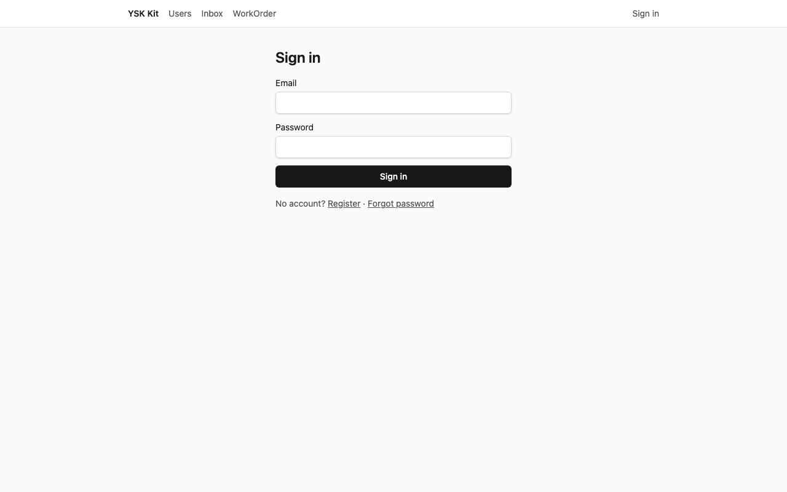
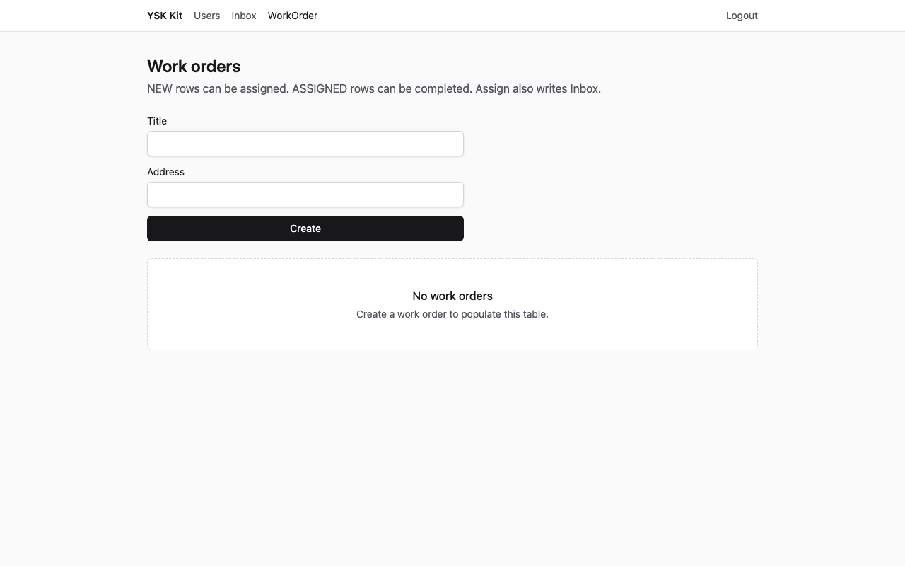
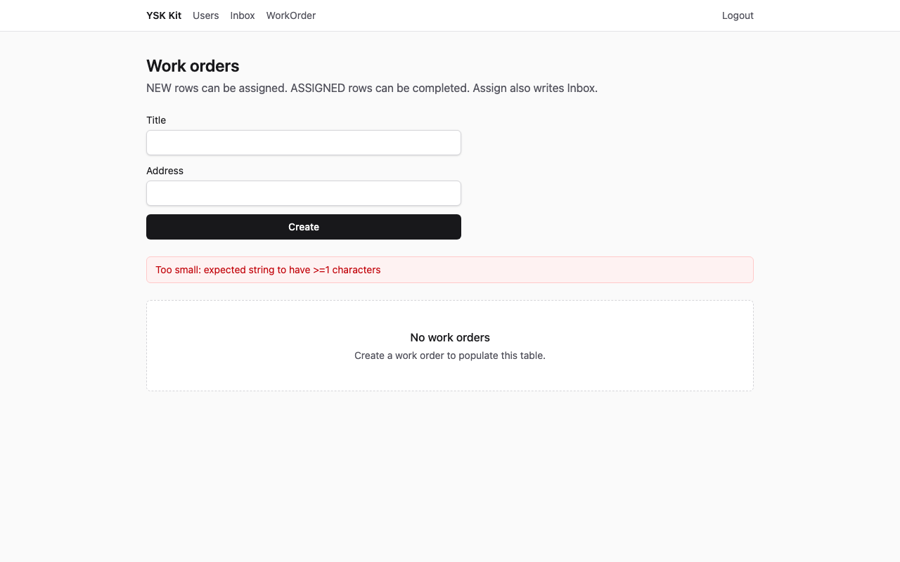
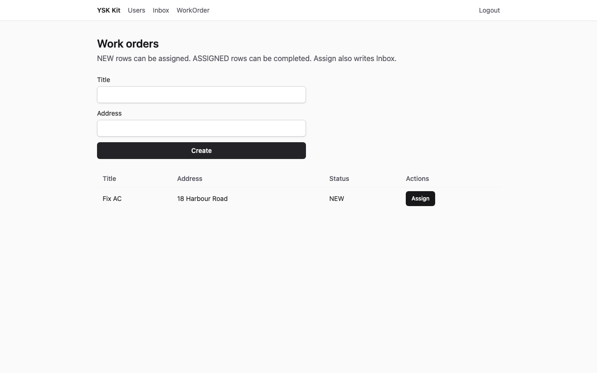
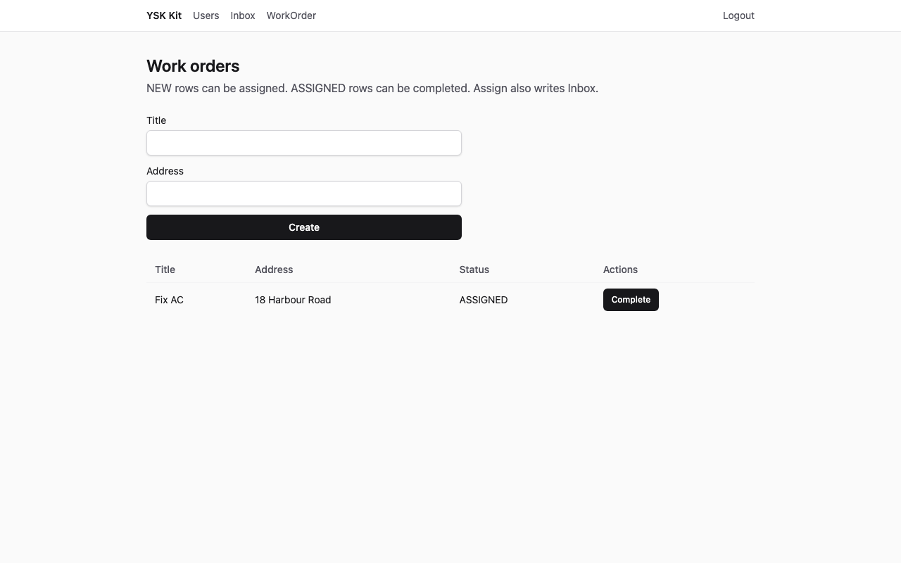
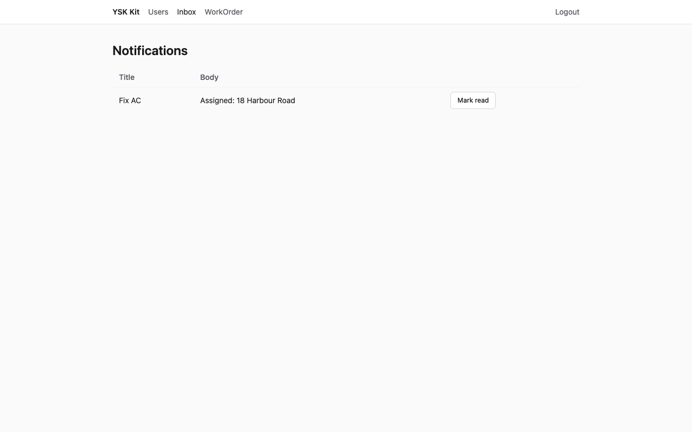
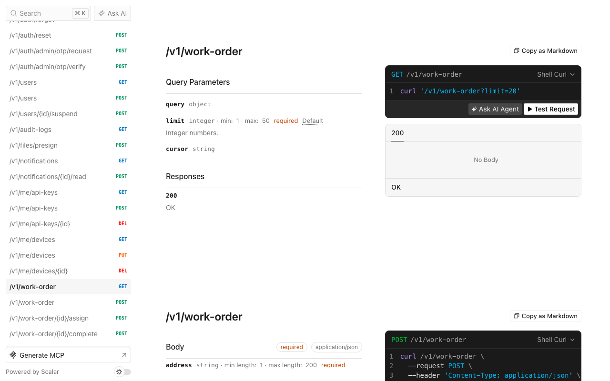

# 外勤工單

Language: [English](tutorial.md) · 中文

精簡 SaaS 產品，給外勤技術員用：網頁工單，Expo 共用同一個收件箱。一個六角形模組，另加 `ysk-kit add push`。

以下截圖為 1280×800，對已套用的目的地擷取（API **13001**，web **15173**）。沒有虛構流動截圖；Expo 讀同一個 `GET /v1/notifications`。

## 1. 完成後你會得到甚麼

- 新產品目錄，含 `--preset thin` 的身份、檔案、通知、工作、郵件、API 金鑰、加密與即時通道，**加上 mobile** 與 **push**。
- 模組 `work-order`：`GET/POST /v1/work-order`、`POST /v1/work-order/:id/assign`、`POST /v1/work-order/:id/complete`。
- 網頁 `/work-order`（導航 **WorkOrder**）。`NEW` 列有 **Assign**，`ASSIGNED` 列有 **Complete**。thin+push 已有 **Inbox**。
- 指派會 `enqueue('notification.create')`，類型 `work.assigned`。開發環境 `RUN_WORKERS=1` 時 worker 在 API 行程內跑，Inbox 隨即出現該列。
- Seed 帳戶 `admin@ysk.hk`／`ysk-admin-dev` 與 `user@ysk.hk`／`ysk-user-dev`。管理員有一張 `NEW` 工單；使用者列表由空白開始。



**預期效果：**登入表單。標題 **Sign in**。

## 2. 誰適用、預計時間

設施、冷氣，以及任何「到場加狀態」。第一次約 **20–30 分鐘**。

## 3. 前置

- **Node 24** 與 **pnpm 12**
- 此 kit 的 checkout
- 可選：若改 `--db mysql`，需要 Docker MySQL 8.4

Expo 會一併開倉；完成網頁逐步不必接真機。

## 4. 為甚麼這個 flavor／preset／資料庫

| 選擇 | 值 | 原因 |
|---|---|---|
| Flavor | `saas` | Web + API + mobile |
| Preset | `thin` | 十五分鐘路徑，再還原 **push** |
| 資料庫 | `spec.json` 為 sqlite | 不需 Docker。Compose 可傳 `--db mysql` |
| Admin | 關閉 | 調度／執業者的 Web 介面 |
| Mobile | 開啟 | Expo InboxScreen 共用 `GET /v1/notifications` |

行業工單**不會**掛在 living kit API。

## 5. 開倉命令

```bash
pnpm --filter @ysk-kit/examples start apply field-work-orders --dest ~/Projects/my-field --yes
```

預設目的地（已 gitignore）：`examples/.runs/field-work-orders`。覆蓋上一次結果請加 `--force`。

手動（sqlite）：`create-ysk-app` thin saas sqlite `--no-admin --yes`（保留 mobile），然後 `ysk-kit add push`、`ysk-kit add module work-order --prisma --web`，複製此 overlay，替換 Prisma 模型 `WorkOrder`，套用 `patches.json`，`prisma db push`，seed。

## 6. 加哪些 module／capability，為甚麼這個順序

`spec.json` 能力：`["push"]`。模組：`work-order` 帶 `--prisma --web`。套用器先 `ysk-kit add push` 再加模組，裝置、worker 與 Inbox 才接得上。

`examples/field-work-orders/patches.json` 必須把 composition 的 `queue` 傳進服務：

1. `apps/api/src/composition.ts` — `createWorkOrderService(..., queue)`
2. `apps/api/src/create-memory-input.ts` — memory harness 同樣

overlay 亦覆寫 `packages/contracts/src/enums/notification-type.ts`，在 `AUTH_WELCOME`、`AUTH_RESET`、`USER_CREATED`、`ORG_INVITED` 旁邊加上 `WORK_ASSIGNED: 'work.assigned'`。不要 import BullMQ；應用層用 `@ysk-kit/jobs` 的 `IJobQueue`（auth-service 已經這樣做）。

## 7. 資料模型

**WorkOrder**（狀態是 Prisma `String`，contracts 內 `as const` + Zod —— 沒有 TypeScript `enum`）：

| 欄位 | 類型 | 規則 |
|---|---|---|
| `title` | 1–80 | 必填 |
| `address` | 1–200 | 必填 |
| `status` | `NEW` \| `ASSIGNED` \| `DONE` | 建立時為 `NEW` |

誰可讀寫：已登入使用者列出**自己的**列。指派與完成要求同一個 `authorId`。

## 8. 業務規則

全部寫在 `createWorkOrderService(repo, jobs?: IJobQueue)`。

1. 空白標題 → `VALIDATION_FAILED`（HTTP 422）。
2. `POST /v1/work-order/:id/assign`：擁有人且 `NEW` → `ASSIGNED`。否則 `CONFLICT`。不明 id 或別人的列 → `NOT_FOUND`。
3. 指派時 `jobs.enqueue('notification.create', { userId: authorId, type: 'work.assigned', title: row.title, body: \`Assigned: ${row.address}\` })`。
4. `POST /v1/work-order/:id/complete`：擁有人且 `ASSIGNED` → `DONE`。否則 `CONFLICT`。
5. 沒有工作階段 → `UNAUTHENTICATED`（HTTP 401）。

記憶體測試傳假 queue（`vi.fn` 或 array push）。HTTP 指派回 **200**，`status: ASSIGNED`。

## 9. overlay 把哪些檔換成填好的版本

產生器仍用 `title`／`body`。overlay 覆寫 DTO、合約、服務、倉庫、HTTP 測試、Prisma 片段、SDK、web-sdk、頁面、seed 與 `notification-type.ts`。`app.ts` 與 `router.tsx` 維持 CLI 修補結果。`patches.json` 注入 `queue` —— 不要 overlay 整份 `composition.ts`。

## 10. seed 會插入甚麼

| 電郵 | 密碼 | 角色 | 工單 |
|---|---|---|---|
| `admin@ysk.hk` | `ysk-admin-dev` | ADMIN | Inspect lift，1 Queen's Road，`NEW` |
| `user@ysk.hk` | `ysk-user-dev` | USER | 沒有 |

## 11. 啟動與登入

```bash
cd ~/Projects/my-field
pnpm dev
```

`.env` 保持 `NODE_ENV=development` 與 `RUN_WORKERS=1`，指派才會在 API 行程寫入 Inbox。

開啟 http://localhost:5173/login。以 `user@ysk.hk`／`ysk-user-dev` 登入。登入後到 `/users`。在導航開啟 **WorkOrder**。

## 12. UI 逐步



**預期效果：**標題 **Work orders**，空白狀態 **No work orders**。

標題留空，按 **Create**。



**預期效果：**警告橫額出現。表格仍是空的。

標題填 `Fix AC`，地址 `18 Harbour Road`，Create。



**預期效果：**一列 **Fix AC**，狀態 `NEW`，按鈕 **Assign**。

先看 Scalar（下一節），再回到 `/work-order`，按 **Assign**。狀態變成 `ASSIGNED`，按鈕變成 **Complete**。



開啟 **Inbox**（導航 `/notifications`）。等到 **Fix AC**。



**預期效果：**一則通知，標題 **Fix AC**，內文 `Assigned: 18 Harbour Road`。

Expo 的 `InboxScreen` 呼叫同一個 `GET /v1/notifications`。本教程不要期望另有流動 PNG。

## 13. HTTP 逐步

基底 URL http://localhost:3001（擷取時為 **13001**）。`POST /v1/auth/login` 取得 Bearer。

**預期效果**（`expected/create-ok.json`）：HTTP **201**

```json
{
  "ok": true,
  "data": {
    "title": "Fix AC",
    "address": "18 Harbour Road",
    "status": "NEW"
  }
}
```

空白標題 → HTTP **422** `{ "ok": false, "error": { "code": "VALIDATION_FAILED" } }`。

指派（`expected/assign-ok.json`）：HTTP **200** `{ "ok": true, "data": { "status": "ASSIGNED" } }`。

再指派一次，或完成一張 `NEW` → HTTP **409** `CONFLICT`。

沒有 `Authorization` → HTTP **401** `UNAUTHENTICATED`。

指派：`POST /v1/work-order/:id/assign`，本文 `{}`。完成：`POST /v1/work-order/:id/complete`。

## 14. Scalar `/docs`



**預期效果：**Scalar 列出 `GET`／`POST /v1/work-order`，以及 `/v1/work-order/{id}/assign` 與 `/complete`。執行 `pnpm gen:openapi` 之後，目的地的 `docs/openapi.yaml` 含有相同路徑。

## 15. 驗證命令

在目的地內：

```bash
pnpm layers && pnpm typecheck && pnpm test && pnpm gen:openapi && pnpm ysk-kit check agent
```

**預期效果：**全部綠色。工單測試涵蓋指派 enqueue、HTTP 200 `ASSIGNED`、空白標題與 401。`ysk-kit check agent` 報告沒有 TypeScript `enum`。

## 16. 本例不做甚麼

- 把 `work-order` 掛進 living kit
- 調度地圖、技術員角色，或另做流動工單畫面
- 虛構 Expo 截圖（InboxScreen 就是同一個通知列表）
- CI 內真實 FCM／Redis

## 17. 下一例

這是目錄的最後一個已完成系統。回到[實例索引](../README.zh.md)。
