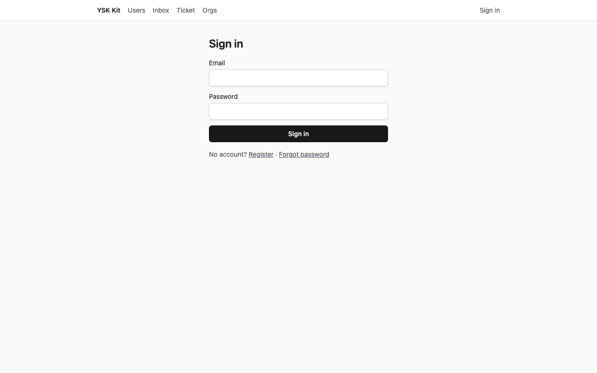
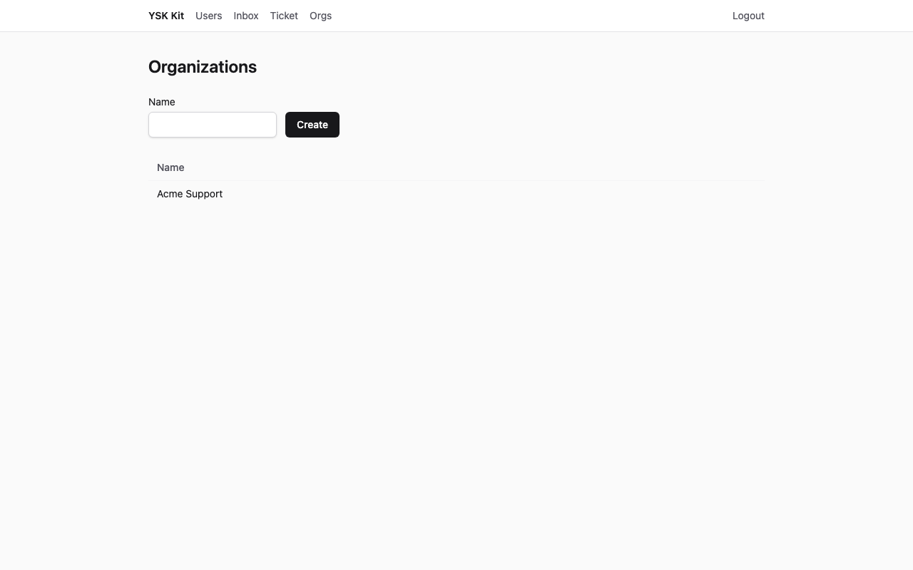
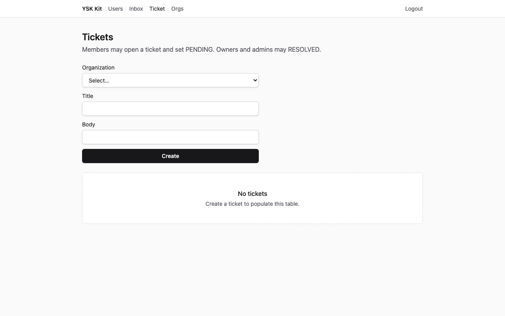
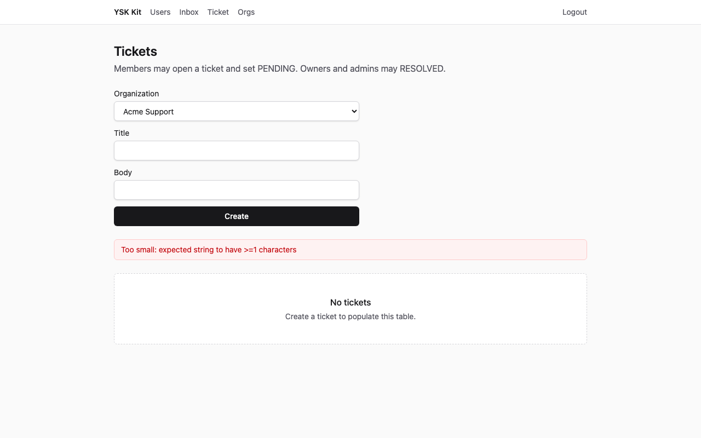
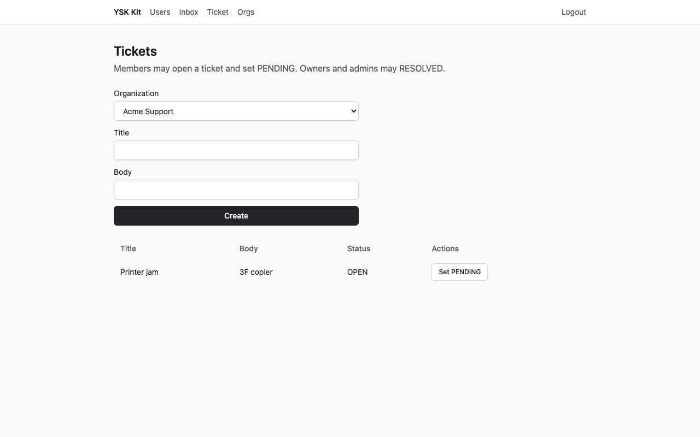
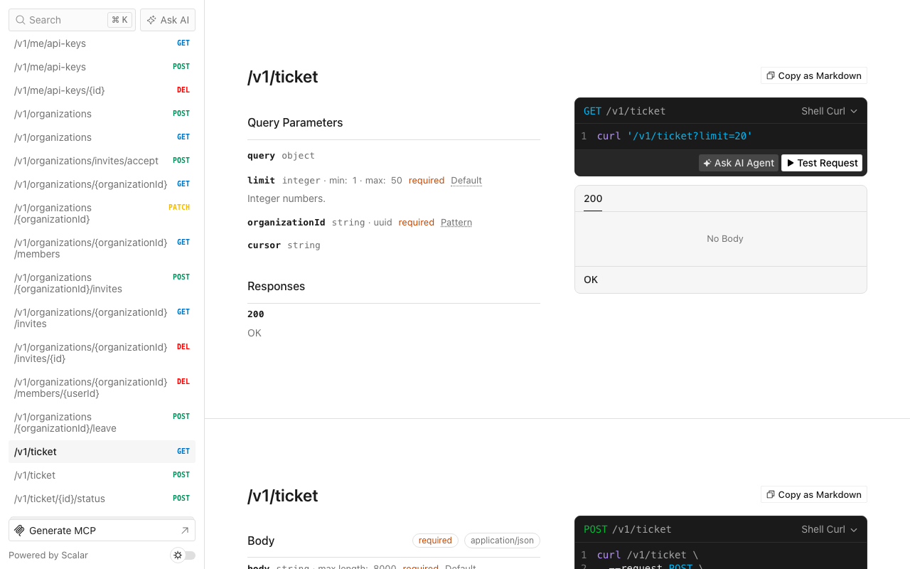

# 客服工單

Language: [English](tutorial.md) · 中文

一個 thin SaaS 產品，把支援工單放在組織之內。本例在行業模組之前先執行 `ysk-kit add team`。

以下截圖為 1280×800，對已套用的目的地擷取（API **13001**、web **15173**）。living kit 的 3001／5173 保持空閒。

## 1. 完成後你會得到甚麼

完成之後：

- 一個**新產品目錄**（不是本 kit），來自 `--preset thin`：身分、檔案、通知、工作、郵件、API 金鑰、加密與即時通訊。
- `ysk-kit add team` 的組織：導航文字 **Orgs**，頁面標題 **Organizations**，建立表單標籤 **Name**，按鈕 **Create**。
- Hexagonal 模組 `ticket`，路徑 `GET/POST /v1/ticket`，另有 `POST /v1/ticket/:id/status`。
- Web 頁 `/ticket`（導航 **Ticket**）：組織 `<select>`、Title、Body。只有選了組織才載入列表。
- 種子帳戶 `admin@ysk.hk`／`ysk-admin-dev` 與 `user@ysk.hk`／`ysk-user-dev`。**不會**預先插入組織；擷取腳本建立 **Acme Support**，已登入使用者就是 OWNER。
- 記憶體 port 測試：會籍、MEMBER 對 OWNER 的狀態規則，以及 HTTP envelope。



**預期效果：** Sign in 表單，欄位 Email 與 Password。標題 **Sign in**。

## 2. 誰適用、預計時間

內部客服，以及任何「工單屬於組織、不是單一個使用者」的產品。第一次約 **20–30 分鐘**（開倉 + team + overlay + seed）。只閱讀本頁也可以看清欄位與 envelope。

## 3. 前置

- **Node 24** 與 **pnpm 12**
- 本 kit 的工作副本（套用器在此）
- 可選：若改用 `--db mysql`，需要 Docker MySQL 8.4

SQLite 不需要 Compose。套用命令依 `spec.json` 預設 sqlite。

## 4. 為甚麼這個 flavor、preset 與資料庫

| 選擇 | 值 | 原因 |
|---|---|---|
| Flavor | `saas` | Web + API。Gateway／php-bridge／trading／static-web3 已有 flavor 手冊。 |
| Preset | `thin` | 十五分鐘路徑。team 另行加入；沒有 llm、billing 或 push。 |
| 資料庫 | CI 與 `spec.json` 用 sqlite | 不需要 Docker。接近生產的本機工作可傳 `--db mysql`。 |
| Admin 應用 | 關閉 | 本例是客服 Web 介面。 |
| 流動應用 | 關閉 | 外勤工單是較後的實例。 |

行業工單**不會**掛進 living kit 的 API。overlay 只複製到**目的地**。

## 5. 開倉命令

在 kit 工作副本執行：

```bash
pnpm --filter @ysk-kit/examples start apply helpdesk-tickets --dest ~/Projects/my-helpdesk --yes
```

`--yes` 會傳給 `create-ysk-app`，agent 與 CI 不會等待 TTY。預設目的地（已 gitignore）是 `examples/.runs/helpdesk-tickets`。覆蓋上一次結果：

```bash
pnpm --filter @ysk-kit/examples start apply helpdesk-tickets --yes --force
```

人手等價步驟（sqlite）：

```bash
pnpm --filter @ysk-kit/create-app start my-helpdesk --preset thin --flavor saas --db sqlite --no-admin --no-mobile --yes
cd my-helpdesk
pnpm install
cp .env.example .env
pnpm ysk-kit add team
pnpm ysk-kit add module ticket --prisma --web
# 然後把 examples/helpdesk-tickets/overlay/ 覆寫進此樹
# 用 overlay 片段取代 apps/api/prisma/schema.prisma 內的 model Ticket
# 套用 examples/helpdesk-tickets/patches.json，讓記憶體工單倉庫讀同一份組織會籍
pnpm db:generate && pnpm --filter @ysk-kit/api exec prisma db push && pnpm db:seed
pnpm gen:openapi
pnpm dev
```

SQLite 略過 Compose，並用 `prisma db push` 代替 `migrate dev`（migrate 會進入互動模式）。

## 6. 模組與能力，以及這個順序的原因

`spec.json` 先列能力 `team`，再列模組 `ticket`（`--prisma --web`）。**先加 team**，`Organization`／`Membership` 才存在，工單的 `getMembership` 才能讀。套用器在同時出現時已會先 `team` 再 `billing`；本例沒有 billing。

`ysk-kit add module` 寫出 hexagonal 切片，並修補 Express、Fastify、composition、SDK、web-sdk 與 web 路由（`/ticket`，導航 **Ticket**）。產生器仍使用沒有組織的 `title`／`body`。overlay 隨後覆寫那些檔。

`examples/helpdesk-tickets/patches.json` 會改 `create-memory-input.ts`，讓 `createMemoryTicketRepository(orgs)` 向**同一**記憶體組織倉庫查會籍（`organizationService` 寫入的就是它）。禁止整份 overlay `create-memory-input.ts`。HTTP 測試會註冊使用者 A、`POST /v1/organizations`，再用該 org id `POST /v1/ticket`。

## 7. 資料模型

Prisma model `Ticket`（狀態是 `String`，不是 TypeScript `enum`）。**沒有**連到 `Organization` 的 Prisma relation（overlay 不可取代 team 的 Organization model）。

| 欄位 | 類型 | 規則 |
|---|---|---|
| `id` | UUID | 自動產生 |
| `title` | 字串，1–200 | 必填 |
| `body` | 字串，≤ 8000 | 預設 `""` |
| `organizationId` | UUID | 工單所屬組織 |
| `status` | `OPEN` \| `PENDING` \| `RESOLVED` | `@ysk-kit/contracts` 內 `as const` + Zod。建立時為 `OPEN` |
| `authorId` | UUID | 開單的已登入使用者 |
| `createdAt`／`updatedAt` | datetime | Prisma |

誰可讀寫：該組織的**任何成員**。列表 query **必須**帶 `organizationId`（UUID）。沒有會籍是 `FORBIDDEN`（HTTP 403），不是 `NOT_FOUND`。

## 8. 業務規則

全部寫在 `apps/api/src/modules/ticket/application/ticket-service.ts`。

1. 該 `organizationId` 沒有會籍 → `FORBIDDEN`（HTTP 403）。不明組織仍是 403，不是 404。
2. 建立時狀態為 `OPEN`。任何成員都可以開單。
3. `MEMBER` 可把狀態設成 `PENDING`。`MEMBER` 設 `RESOLVED`（或 `OPEN`）→ `FORBIDDEN`。
4. `OWNER` 與 `ADMIN` 可設 `RESOLVED`（以及其他狀態）。
5. 狀態 API 遇上不明工單 id → `NOT_FOUND`（HTTP 404）。
6. 空白標題 → `VALIDATION_FAILED`（HTTP 422）。
7. 沒有 session → `UNAUTHENTICATED`（HTTP 401）。
8. 列表沒有 `organizationId` → `VALIDATION_FAILED`（HTTP 422）。

倉庫 port `getMembership(userId, orgId)` 回傳 `{ role: 'OWNER' | 'ADMIN' | 'MEMBER' } | null`。Prisma 使用 `prisma.membership.findUnique({ where: { organizationId_userId: { organizationId, userId } } })`。記憶體測試可用 `seedMembership`，或傳入組織記憶體倉庫。

## 9. overlay 與產生器預設的對照

| 路徑 | 產生器 | Overlay |
|---|---|---|
| `packages/contracts/src/dto/ticket.ts` | `title`、`body` | 加上 `organizationId`、`status`；列表 query 延伸 `PageQuerySchema` |
| `packages/contracts/src/api/ticket.ts` | list + create | list（組織 query）、create、status |
| `application/ticket-service.ts` | 直通 | 會籍 + 狀態角色 |
| `infra/*-ticket-repository.ts` | title／body 列 | 按組織列表、`getMembership`、`updateStatus` |
| `infra/ticket-router.ts` | list + create | 三個 handler |
| `infra/ticket.test.ts` | 建立／列表 | 規則 + HTTP envelope（建立組織後 201，使用者 B 為 403） |
| `modules/ticket/prisma/ticket.prisma` | title／body | 工單 model，**沒有** Organization relation |
| `packages/sdk`／`web-sdk` | list／create | list 必填 `organizationId`；`useList` `enabled: Boolean(organizationId)` |
| `apps/web/.../ticket-page.tsx` | title／body 表單 | 組織選單、EmptyState **No tickets**、noValidate |
| `apps/api/src/infra/seed.ts` | 兩個使用者 | 兩個使用者，**沒有組織** |
| `app.ts`／`router.tsx` | CLI 修補 | **不**在 overlay 內 |

## 10. seed 資料

`pnpm db:seed` 會 upsert：

| 電郵 | 密碼 | 角色 | 組織／工單 |
|---|---|---|---|
| `admin@ysk.hk` | `ysk-admin-dev` | ADMIN | 沒有 |
| `user@ysk.hk` | `ysk-user-dev` | USER | 沒有 |

截圖以 **user@ysk.hk** 登入，並在介面建立 **Acme Support**，該使用者就是 OWNER。

## 11. 啟動與登入

```bash
cd ~/Projects/my-helpdesk   # 或 examples/.runs/helpdesk-tickets
pnpm dev
```

| 介面 | 網址 |
|---|---|
| API | http://localhost:3001 |
| Web | http://localhost:5173 |
| Scalar | http://localhost:3001/docs |

開啟 http://localhost:5173/login。

**預期效果：** 標題 **Sign in**、欄位 Email 與 Password、按鈕 **Sign in**。

以 `user@ysk.hk`／`ysk-user-dev` 登入。登入頁會導向 `/users`。在導航開啟 **Orgs**（路徑 `/orgs`）。頁面標題是 **Organizations**。

## 12. UI 逐步

### 建立組織



**Name** 填 `Acme Support`。按 **Create**。

**預期效果：** 表格出現 **Acme Support**。

### 空白列表

開啟 **Ticket**（路徑 `/ticket`）。



**預期效果：** 標題 **Tickets**、建立表單，以及 EmptyState 標題 **No tickets**。

### 非法標題

Organization 選 **Acme Support**。Title 留空（或空白）。按 **Create**。表單使用 `noValidate`，瀏覽器不會攔截提交。



**預期效果：** 錯誤橫額（role `alert`）。表格仍是空的。

### 已建立的列

Title 填 `Printer jam`，Body 填 `3F copier`。按 **Create**。



**預期效果：** 表格出現 **Printer jam**，本文 `3F copier`，狀態 `OPEN`。EmptyState 消失。

## 13. HTTP 逐步

所有 JSON 路由使用 `{ ok: true, data }`／`{ ok: false, error }`。先註冊或登入；送出 `Authorization: Bearer <accessToken>` 與 `x-ysk-platform: web`。先建立組織，再用其 id。

### 成功 — `POST /v1/ticket`

```bash
curl -sS http://localhost:3001/v1/ticket \
  -H 'content-type: application/json' \
  -H 'x-ysk-platform: web' \
  -H "authorization: Bearer $TOKEN" \
  -d '{"title":"Printer jam","body":"3F copier","organizationId":"'"$ORG_ID"'"}'
```

**預期效果**（id 與時間戳會變；見 `expected/create-ok.json`）：

```json
{
  "ok": true,
  "data": {
    "title": "Printer jam",
    "body": "3F copier",
    "status": "OPEN"
  }
}
```

HTTP 狀態 **201**。

### 非法標題

使用 `"title":""`。

**預期效果**（`expected/create-invalid.json`）：HTTP **422**

```json
{ "ok": false, "error": { "code": "VALIDATION_FAILED" } }
```

### 沒有權限

再註冊第二個使用者。用使用者 A 的 `organizationId` POST 工單。

**預期效果**（`expected/forbidden.json`）：HTTP **403**

```json
{ "ok": false, "error": { "code": "FORBIDDEN" } }
```

### 沒有 session

省略 Authorization 標頭。

**預期效果**（`expected/unauthenticated.json`）：HTTP **401**

```json
{ "ok": false, "error": { "code": "UNAUTHENTICATED" } }
```

狀態：`POST /v1/ticket/:id/status`，本文 `{ "status": "PENDING" }` 或 `"RESOLVED"`。列表：`GET /v1/ticket?organizationId=<uuid>`。

## 14. Scalar `/docs`

開啟 http://localhost:3001/docs（使用 `capture` 時為埠 13001）。



**預期效果：** Scalar API 參考 HTML。`GET /openapi.json` 列出 `/v1/ticket` 與 `/v1/ticket/{id}/status`。執行 `pnpm gen:openapi` 之後，目的地的 `docs/openapi.yaml` 含有相同路徑。team 路由 `/v1/organizations` 也會出現。

## 15. 驗證命令

在目的地內：

```bash
pnpm layers && pnpm typecheck && pnpm test && pnpm gen:openapi && pnpm ysk-kit check agent
```

**預期效果：** 全部綠色。工單測試涵蓋會籍、MEMBER 對 OWNER 狀態、建立組織後 HTTP 201、外人 403、422 與 401。`ysk-kit check agent` 報告 `ysk-kit check agent: ok`（沒有 TypeScript `enum`、web 沒有 Prisma、沒有 raw `fetch`）。

套用器除非傳 `--skip-verify`，否則已經跑這條門檻。

## 16. 本例不做甚麼

- 把 `ticket` 掛進 living kit
- SLA 計時、分派佇列或電郵回覆
- `ysk-kit add billing`（見 membership-club）
- 真實 Stripe、Twilio、FCM、Redis、Jaeger、Grafana
- CI 視覺截圖比對（PNG 是文件；CI 以 sqlite 套用並跑測試）

## 17. 下一例

會員訂閱（`membership-club`）是[實例索引](../README.zh.md)的下一個系統。它保留 team，並加上 billing。
