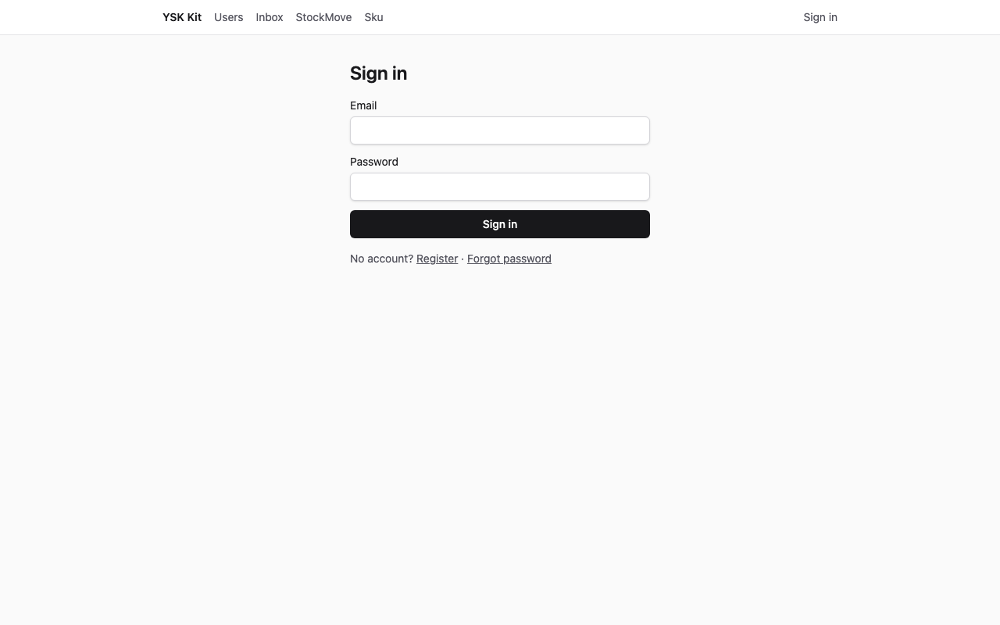
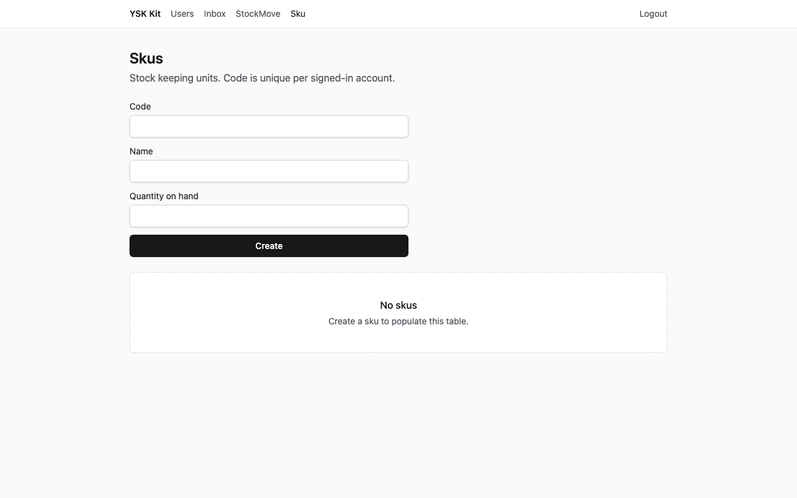
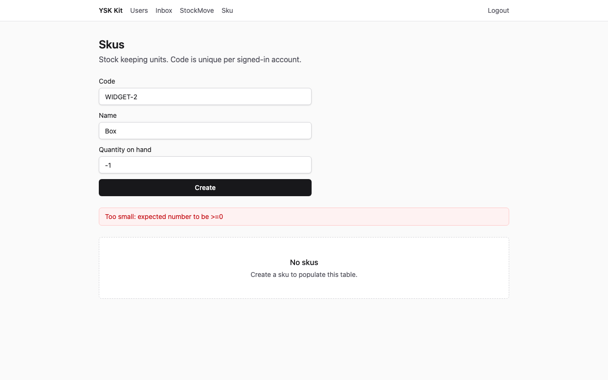
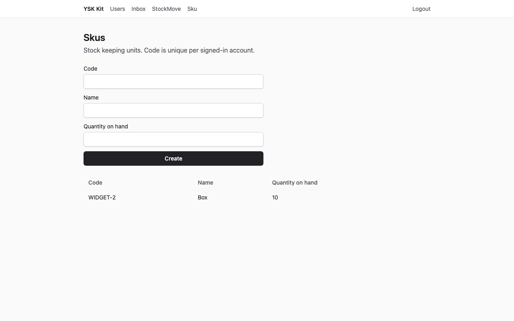
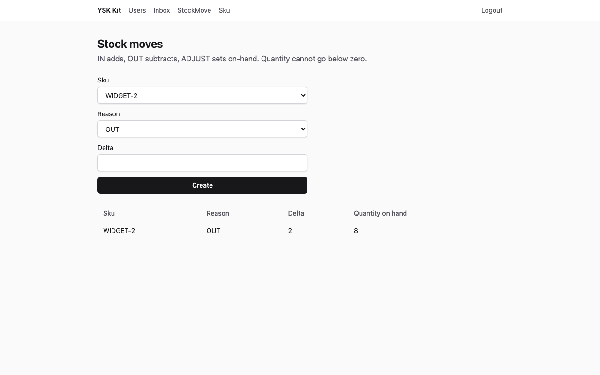
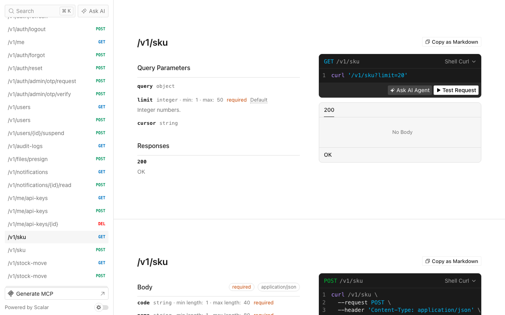

# 進銷存

語言：[English](tutorial.md) · 中文

精簡 SaaS 產品，追蹤 SKU 與庫存異動。兩個六角形模組，沒有額外能力。

以下截圖為 1280×800，對已套用的目的地擷取（API **13001**，web **15173**）。

## 1. 完成後你會得到甚麼

- 模組 `sku`：`GET/POST /v1/sku`。
- 模組 `stock-move`：`GET/POST /v1/stock-move`。`OUT` 或 `ADJUST` 若令 `qtyOnHand` 變負會被拒絕。
- 網頁 `/sku` 與 `/stock-move`（導航文字 **Sku** 與 **StockMove**）。
- Seed 帳戶 `admin@ysk.hk`／`ysk-admin-dev`（SKU `WIDGET-1`，數量 10）與 `user@ysk.hk`／`ysk-user-dev`（空白列表）。



**預期效果：**登入表單。標題 **Sign in**。

## 2. 誰適用、預計時間

小型倉庫與零售櫃檯。第一次約 **20–30 分鐘**。

## 3. 前置

- **Node 24** 與 **pnpm 12**
- 此 kit 的 checkout
- 可選：若改 `--db mysql`，需要 Docker MySQL 8.4

## 4. 為甚麼這個 flavor／preset／資料庫

| 選擇 | 值 | 原因 |
|---|---|---|
| Flavor | `saas` | Web + API |
| Preset | `thin` | 十五分鐘路徑 |
| 資料庫 | `spec.json` 為 sqlite | 不需 Docker |
| Admin／mobile | 關閉 | 桌面 web 已足夠 |

行業庫存 **不會**掛在 living kit API。

## 5. 開倉命令

```bash
pnpm --filter @ysk-kit/examples start apply inventory-stock --dest ~/Projects/my-stock --yes
```

預設目的地：`examples/.runs/inventory-stock`。覆蓋上一次結果請加 `--force`。

## 6. 加哪些 module／capability，為甚麼這個順序

`spec.json` 先 `sku` 再 `stock-move`。能力清單空白。先加父模組，子模組的 Prisma 片段才能寫 `sku Sku @relation(...)`。

`patches.json` 讓兩個服務共用同一個記憶體 SKU 倉庫。

## 7. 資料模型

**Sku：**`code`（每個作者唯一）、`name`、`qtyOnHand`（整數 ≥ 0）。

**Stock-move：**`skuId`、`delta`（整數 > 0）、`reason` `IN` \| `OUT` \| `ADJUST`。

誰可讀寫：已登入使用者列出**自己的**列。

## 8. 業務規則

1. 同一作者重複 `code` → `CONFLICT`。
2. 建立時 `qtyOnHand < 0` → `VALIDATION_FAILED`。
3. `IN`：`qtyOnHand += delta`。`OUT`：`qtyOnHand -= delta`。`ADJUST`：`qtyOnHand = delta`。
4. `OUT` 或 `ADJUST` 令數量變負 → `CONFLICT`（數量不變）。
5. SKU 不存在或不屬作者 → `NOT_FOUND`。
6. 沒有工作階段 → `UNAUTHENTICATED`。

## 9. overlay 把哪些檔換成填好的版本

產生器仍用 `title`／`body`。overlay 覆寫 DTO、合約、服務、倉庫、HTTP 測試、Prisma 片段、SDK、web-sdk、兩個頁面與 seed。`app.ts` 與 `router.tsx` 維持 CLI 修補結果。

## 10. seed 會插入甚麼

| 電郵 | 密碼 | 角色 | SKU |
|---|---|---|---|
| `admin@ysk.hk` | `ysk-admin-dev` | ADMIN | `WIDGET-1`，數量 10 |
| `user@ysk.hk` | `ysk-user-dev` | USER | 沒有 |

## 11. 啟動與登入

```bash
cd ~/Projects/my-stock
pnpm dev
```

以 `user@ysk.hk`／`ysk-user-dev` 登入。在導航開啟 **Sku**。

## 12. UI 逐步



**預期效果：**空白狀態 **No skus**。

建立代碼 `WIDGET-2`、名稱 `Box`、數量 `-1`。



**預期效果：**警告橫額。

把數量改成 `10` 再 Create。



**預期效果：**一列 `WIDGET-2`，數量 10。

開啟 `/stock-move`，Sku 選 **WIDGET-2**，原因 **OUT**，delta `2`，Create。



**預期效果：**一列 `OUT`。該 SKU 數量變 8。

## 13. HTTP 逐步

**預期效果**（`expected/create-ok.json`）：HTTP **201** `{ "ok": true, "data": { "code": "WIDGET-2", "qtyOnHand": 10 } }`。

數量 `-1` → HTTP **422** `VALIDATION_FAILED`。

`OUT` 大於現有庫存 → HTTP **409** `CONFLICT`。

沒有 `Authorization` → HTTP **401** `UNAUTHENTICATED`。

## 14. Scalar `/docs`



**預期效果：**Scalar 列出 `GET`／`POST /v1/sku`。`GET /openapi.json` 亦列出 `/v1/stock-move`。

## 15. 驗證命令

```bash
pnpm layers && pnpm typecheck && pnpm test && pnpm gen:openapi && pnpm ysk check agent
```

**預期效果：**全部綠色。

## 16. 本例不做甚麼

- 把 `sku` 掛進 living kit
- 多倉、條碼或採購單

## 17. 下一例

客服工單（`helpdesk-tickets`）是 [實例目錄](../README.zh.md) 的下一個系統。
