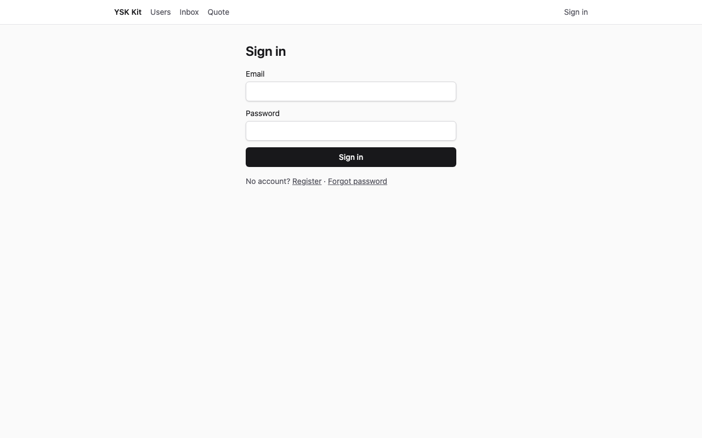
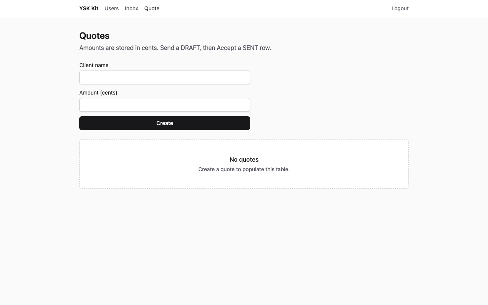
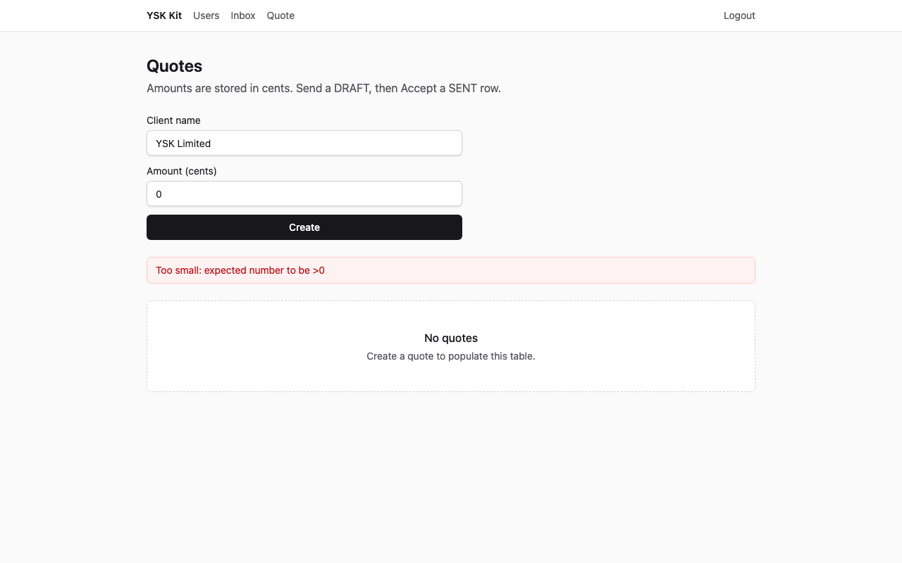
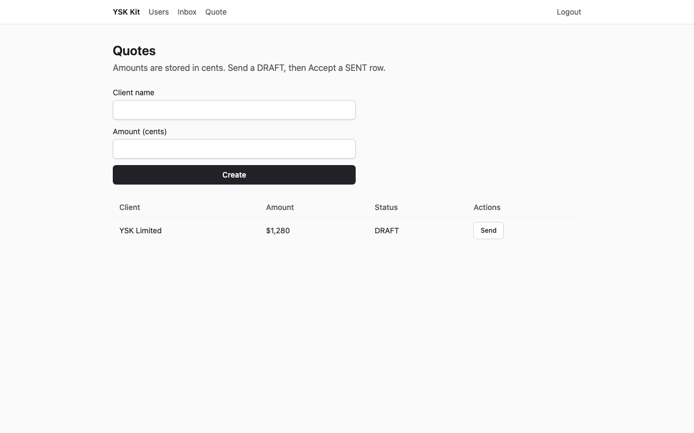
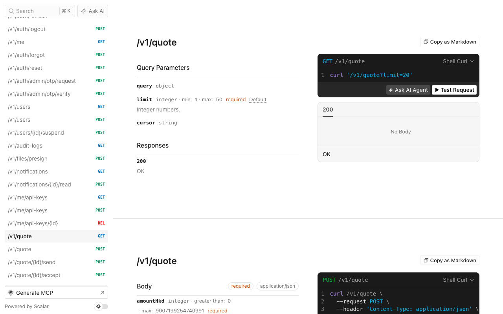

# 報價

Language: [English](tutorial.md) · 中文

精簡 SaaS 產品，以港幣仙存放報價，並由 `DRAFT` 走到 `SENT` 再走到 `ACCEPTED`。一個六角形模組，沒有額外能力。

以下截圖為 1280×800，對已套用的目的地擷取（API **13001**、web **15173**）。living kit 的 3001／5173 保持空閒。

## 1. 完成後你會得到甚麼

完成之後：

- 一個**新產品目錄**（不是本 kit），來自 `--preset thin`：身分、檔案、通知、工作、郵件、API 金鑰、加密與即時通訊。
- Hexagonal 模組 `quote`，路徑 `GET/POST /v1/quote`，另有送出與接受。
- Web 頁 `/quote`：列表、建立表單，`DRAFT` 列上的 **Send** 與 `SENT` 列上的 **Accept**。金額用 `@ysk-kit/ui-logic` 的 `formatHkd` 顯示。
- 種子帳戶 `admin@ysk.hk`／`ysk-admin-dev` 與 `user@ysk.hk`／`ysk-user-dev`。管理員有一張草稿；使用者列表由空白開始。
- 記憶體 port 測試：金額 `0`、送出／接受轉換、列不存在。



**預期效果：** Sign in 表單，欄位 Email 與 Password。標題 **Sign in**。

## 2. 誰適用、預計時間

自由工作者、代理商，以及「具名客戶加港幣數字」的產品。第一次約 **15–25 分鐘**（開倉 + overlay + seed）。只閱讀本頁也可以看清欄位與 envelope。

## 3. 前置

- **Node 24** 與 **pnpm 12**
- 本 kit 的工作副本（套用器在此）
- 可選：若改用 `--db mysql`，需要 Docker MySQL 8.4

SQLite 不需要 Compose。套用命令依 `spec.json` 預設 sqlite。

## 4. 為甚麼這個 flavor、preset 與資料庫

| 選擇 | 值 | 原因 |
|---|---|---|
| Flavor | `saas` | Web + API。Gateway／php-bridge／trading／static-web3 已有 flavor 手冊。 |
| Preset | `thin` | 十五分鐘路徑。沒有 llm、billing、organizations 或 push 裝置。 |
| 資料庫 | CI 與 `spec.json` 用 sqlite | 不需要 Docker。接近生產的本機工作可傳 `--db mysql`。 |
| Admin 應用 | 關閉 | 本例是銷售的 Web 介面。 |
| 流動應用 | 關閉 | 外勤工單是較後的實例。 |

行業報價**不會**掛進 living kit 的 API。overlay 只複製到**目的地**。

## 5. 開倉命令

在 kit 工作副本執行：

```bash
pnpm --filter @ysk-kit/examples start apply invoice-quotes --dest ~/Projects/my-quotes --yes
```

`--yes` 會傳給 `create-ysk-app`，agent 與 CI 不會等待 TTY。預設目的地（已 gitignore）是 `examples/.runs/invoice-quotes`。覆蓋上一次結果：

```bash
pnpm --filter @ysk-kit/examples start apply invoice-quotes --yes --force
```

人手等價步驟（sqlite）：`create-ysk-app` thin saas sqlite `--no-admin --no-mobile --yes`，然後 `ysk-kit add module quote --prisma --web`，複製此 overlay，替換 Prisma 模型 `Quote`，`prisma db push`，seed。

## 6. 模組與能力，以及這個順序的原因

`spec.json` 只列一個模組：`quote`，並帶 `--prisma --web`。**能力清單是空的。** 較後的實例若需要組織與收費，會先 `team` 再 `billing`。

`ysk-kit add module` 寫出 hexagonal 切片，並修補 Express、Fastify、composition、SDK、web-sdk 與 web 路由（`/quote`）。產生器仍使用 `title`／`body`。overlay 隨後把那些檔換成報價欄位。本例沒有 `patches.json`。

## 7. 資料模型

Prisma model `Quote`（狀態是 `String`，不是 TypeScript `enum`）：

| 欄位 | 類型 | 規則 |
|---|---|---|
| `id` | UUID | 自動產生 |
| `clientName` | 字串，1–80 | 必填 |
| `amountHkd` | 整數 `> 0` | 以仙為單位。`z.number().int().positive()` |
| `status` | `DRAFT` \| `SENT` \| `ACCEPTED` | `@ysk-kit/contracts` 內 `as const` + Zod。建立時為 `DRAFT` |
| `authorId` | UUID | 列的擁有者（已登入使用者） |
| `createdAt`／`updatedAt` | datetime | Prisma |

誰可讀寫：已登入使用者只列出**自己的**列。送出與接受要求同一個 `authorId`。

## 8. 業務規則

全部寫在 `apps/api/src/modules/quote/application/quote-service.ts`。

1. 建立時 `amountHkd <= 0` → `VALIDATION_FAILED`（HTTP 422，Zod `positive()`）。
2. `POST /v1/quote/:id/send` 只在 `amountHkd > 0`（Zod 已保證）**且** `status` 為 `DRAFT` 時允許；否則 `CONFLICT`（HTTP 409）。成功則 `DRAFT` → `SENT`。
3. `POST /v1/quote/:id/accept` 只在 `status` 為 `SENT` 時允許；否則 `CONFLICT`。成功則 `SENT` → `ACCEPTED`。
4. 不明 id 或別人的列 → `NOT_FOUND`（HTTP 404）。
5. 沒有 session → `UNAUTHENTICATED`（HTTP 401）。

## 9. overlay 與產生器預設的對照

| 路徑 | 產生器 | Overlay |
|---|---|---|
| `packages/contracts/src/dto/quote.ts` | `title`、`body` | `clientName`、`amountHkd`、`status` |
| `packages/contracts/src/api/quote.ts` | list + create | list、create、send、accept |
| `application/quote-service.ts` | 直通 | 送出／接受轉換 |
| `infra/*-quote-repository.ts` | title／body 列 | 報價欄位 + `getById`／`updateStatus` |
| `infra/quote-router.ts` | list + create | 四個 handler |
| `infra/quote.test.ts` | 建立／列表 | 規則 + HTTP envelope |
| `modules/quote/prisma/quote.prisma` | title／body | 報價 model（並**取代** `schema.prisma` 內的 model） |
| `packages/sdk`／`web-sdk` | list／create | 加上 send／accept |
| `apps/web/.../quote-page.tsx` | title／body 表單 | Client name、Amount (cents)、`formatHkd`、Send／Accept |
| `apps/api/src/infra/seed.ts` | 兩個使用者 | 兩個使用者 + 一張 admin `DRAFT` |

`app.ts` 與 `router.tsx` 維持 CLI 修補結果。

## 10. seed 資料

`pnpm db:seed` 會 upsert：

| 電郵 | 密碼 | 角色 | 報價 |
|---|---|---|---|
| `admin@ysk.hk` | `ysk-admin-dev` | ADMIN | Harbour Sales，`50000` 仙，`DRAFT` |
| `user@ysk.hk` | `ysk-user-dev` | USER | 沒有 |

空白列表的截圖以 **user@ysk.hk** 登入，因此即使 seed 之後表格仍是空的。

## 11. 啟動與登入

```bash
cd ~/Projects/my-quotes   # 或 examples/.runs/invoice-quotes
pnpm dev
```

| 介面 | 網址 |
|---|---|
| API | http://localhost:3001 |
| Web | http://localhost:5173 |
| Scalar | http://localhost:3001/docs |

開啟 http://localhost:5173/login。

**預期效果：** 標題 **Sign in**、欄位 Email 與 Password、按鈕 **Sign in**。

以 `user@ysk.hk`／`ysk-user-dev` 登入。登入頁會導向 `/users`。在導航開啟 **Quote**（路徑 `/quote`）。

## 12. UI 逐步

### 空白列表



**預期效果：** 標題 **Quotes**、建立表單，以及 EmptyState 標題 **No quotes**。

### 非法金額

Client name 填 `YSK Limited`，Amount (cents) 填 `0`。按 **Create**。



**預期效果：** 錯誤橫額（role `alert`）顯示 Zod 正整數訊息（`Too small: expected number to be >0`）。表格仍是空的。

### 已建立的列

Amount (cents) 改為 `128000`。按 **Create**。



**預期效果：** 表格出現 **YSK Limited**，金額 `$1,280`（`formatHkd(item.amountHkd / 100)`），狀態 `DRAFT`，按鈕 **Send**。EmptyState 消失。

在該列按 Send，狀態變成 `SENT`，出現 **Accept**。Accept 會變成 `ACCEPTED` 並隱藏按鈕。對非 `DRAFT` 再 Send，或對非 `SENT` 再 Accept，會回 `CONFLICT`。

## 13. HTTP 逐步

所有 JSON 路由使用 `{ ok: true, data }`／`{ ok: false, error }`。先註冊或登入；送出 `Authorization: Bearer <accessToken>` 與 `x-ysk-platform: web`。

### 成功 — `POST /v1/quote`

```bash
curl -sS http://localhost:3001/v1/quote \
  -H 'content-type: application/json' \
  -H 'x-ysk-platform: web' \
  -H "authorization: Bearer $TOKEN" \
  -d '{"clientName":"YSK Limited","amountHkd":128000}'
```

**預期效果**（id 與時間戳會變；見 `expected/create-ok.json`）：

```json
{
  "ok": true,
  "data": {
    "clientName": "YSK Limited",
    "amountHkd": 128000,
    "status": "DRAFT"
  }
}
```

HTTP 狀態 **201**。

### 非法金額

使用 `"amountHkd":0`。

**預期效果**（`expected/create-invalid.json`）：HTTP **422**

```json
{ "ok": false, "error": { "code": "VALIDATION_FAILED" } }
```

### 狀態不對

對 `DRAFT` 呼叫 `POST /v1/quote/:id/accept`，或對 `SENT` 再呼叫 `POST /v1/quote/:id/send`。

**預期效果**（`expected/conflict.json`）：HTTP **409**

```json
{ "ok": false, "error": { "code": "CONFLICT" } }
```

送出：`POST /v1/quote/:id/send`，本文 `{}`。接受：`POST /v1/quote/:id/accept`。

### 沒有 session

省略 Authorization 標頭。

**預期效果**（`expected/unauthenticated.json`）：HTTP **401**

```json
{ "ok": false, "error": { "code": "UNAUTHENTICATED" } }
```

## 14. Scalar `/docs`

開啟 http://localhost:3001/docs（使用 `capture` 時為埠 13001）。



**預期效果：** Scalar API 參考 HTML。`GET /openapi.json` 列出 `/v1/quote`、`/v1/quote/{id}/send` 與 `/v1/quote/{id}/accept`。執行 `pnpm gen:openapi` 之後，目的地的 `docs/openapi.yaml` 含有相同路徑。

## 15. 驗證命令

在目的地內：

```bash
pnpm layers && pnpm typecheck && pnpm test && pnpm gen:openapi && pnpm ysk-kit check agent
```

**預期效果：** 全部綠色。報價測試涵蓋金額 `0`、送出／接受、錯誤狀態的 `CONFLICT`，以及上面的 HTTP envelope。`ysk-kit check agent` 報告 `ysk-kit check agent: ok`（沒有 TypeScript `enum`、web 沒有 Prisma、沒有 raw `fetch`）。

套用器除非傳 `--skip-verify`，否則已經跑這條門檻。

## 16. 本例不做甚麼

- 把 `quote` 掛進 living kit
- PDF 發票、稅項或 Stripe Checkout（會員訂閱實例稍後提供）
- `ysk-kit add team` 或 billing
- 真實 Stripe、Twilio、FCM、Redis、Jaeger、Grafana
- CI 視覺截圖比對（PNG 是文件；CI 以 sqlite 套用並跑測試）

## 17. 下一例

活動報名（`event-rsvp`）是[實例索引](../README.zh.md)的下一個系統。
