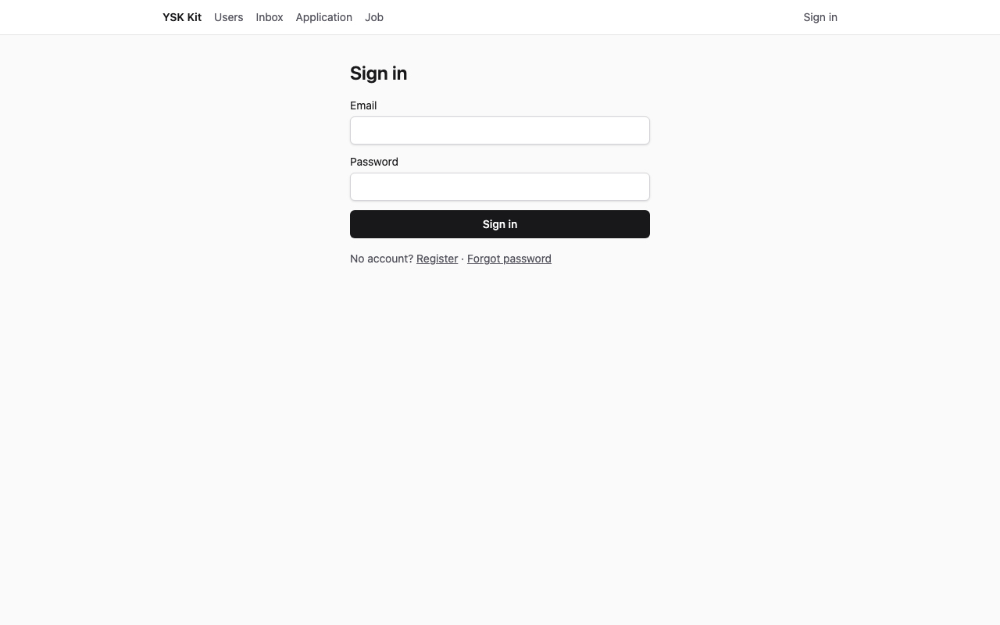
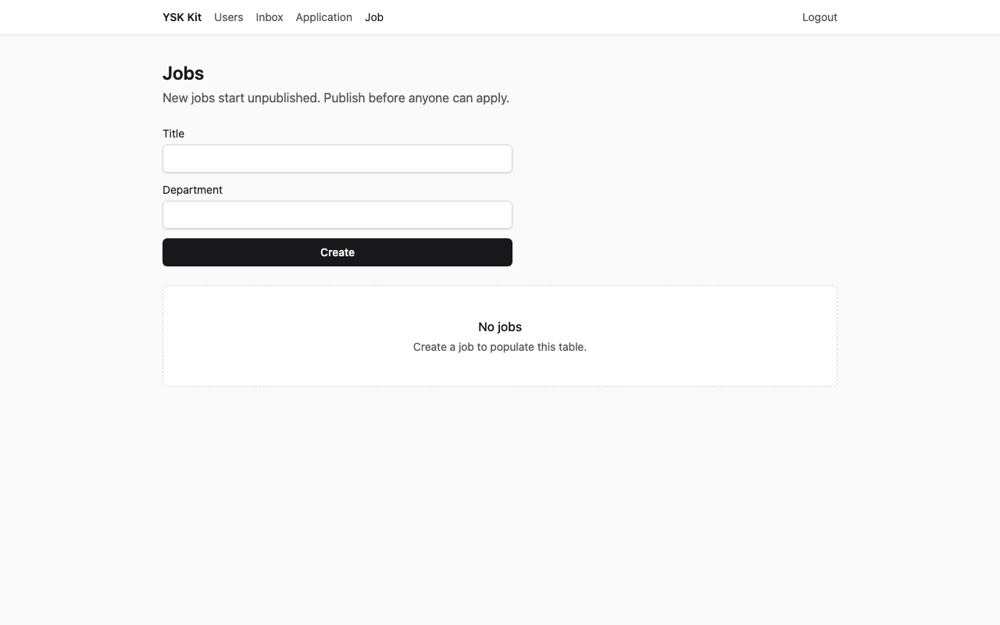
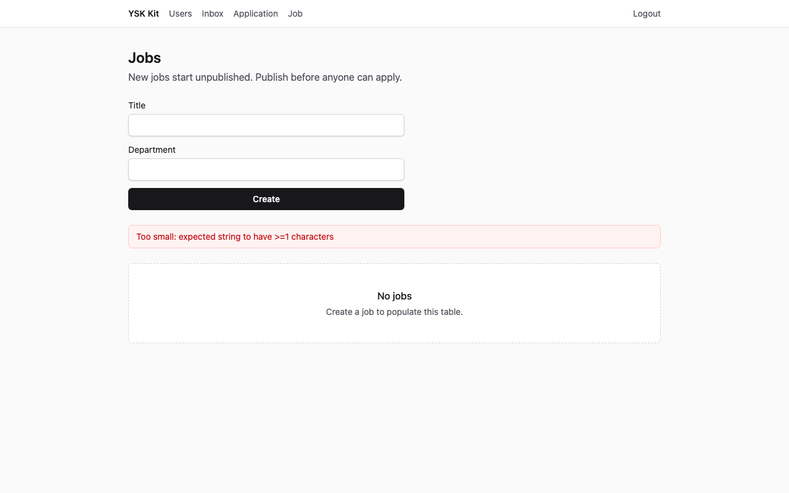
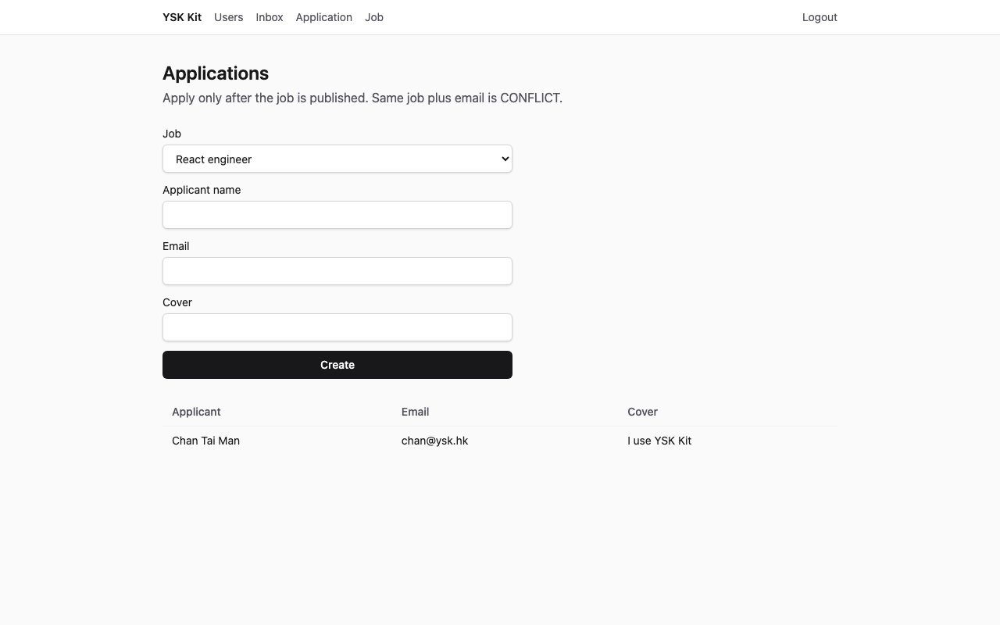
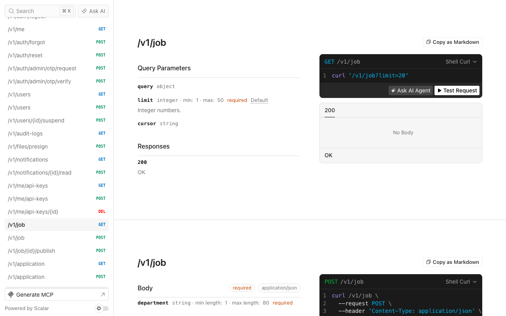

# Job board

Language: [中文](tutorial.zh.md) · English

A thin SaaS product that posts jobs and collects applications. Two hexagonal modules, no extra capabilities.

Screenshots below are 1280×800, captured against an applied destination (API **13001**, web **15173**).

## 1. What you get

After you finish:

- A new product directory with `--preset thin` identity, files, notifications, jobs, mail, API keys, crypto, and realtime.
- Module `job` at `GET/POST /v1/job` plus `POST /v1/job/:id/publish`.
- Module `application` at `GET/POST /v1/application`. Applying to an unpublished job, or the same email twice, is `CONFLICT`.
- Web pages `/job` and `/application` (nav labels **Job** and **Application**). New jobs start **Unpublished**; each row has **Publish**.
- Seed accounts `admin@ysk.hk` / `ysk-admin-dev` and `user@ysk.hk` / `ysk-user-dev`. One published admin job; the user list starts empty.



**Expected:** the Sign in form. Title **Sign in**.

## 2. Who it is for, and how long it takes

Hiring teams and any “opening plus a cover letter”. About **20–30 minutes** the first time.

## 3. Prerequisites

- **Node 24** and **pnpm 12**
- A checkout of this kit
- Optional: Docker MySQL 8.4 if you override `--db mysql`

## 4. Why this flavor, preset, and database

| Choice | Value | Why |
|---|---|---|
| Flavor | `saas` | Web + API |
| Preset | `thin` | Fifteen-minute path. No llm, billing, organizations, or push |
| Database | sqlite in `spec.json` | No Docker. Pass `--db mysql` for Compose |
| Admin / mobile | off | Desktop web is enough |

Industry jobs do **not** mount on the living kit API.

## 5. Scaffold commands

```bash
pnpm --filter @ysk-kit/examples start apply job-board --dest ~/Projects/my-jobs --yes
```

Default destination (gitignored): `examples/.runs/job-board`. Replace a previous run with `--force`.

Equivalent manual steps (sqlite): `create-ysk-app` thin saas sqlite `--no-admin --no-mobile --yes`, then `ysk add module job --prisma --web`, `ysk add module application --prisma --web`, copy this overlay, replace Prisma models `Job` and `Application`, `prisma db push`, seed.

## 6. Modules and capabilities, and why that order

`spec.json` lists `job` then `application`. Capabilities are empty. Add the parent module first so the child Prisma fragment can declare `job Job @relation(...)`.

`examples/job-board/patches.json` rewires the memory harness so both services share one in-memory job repository (`applicationService` is inserted above `jobService`; the patch wraps them around `jobRepo`).

## 7. Data model

**Job** (`published` is a Prisma `Boolean`, not a TypeScript `enum`):

| Field | Type | Rule |
|---|---|---|
| `title` | 1–80 | Required |
| `department` | 1–80 | Required |
| `published` | boolean | Create starts `false` |

**Application:** `jobId`, `applicantName`, `email`, `cover` (1–500). Unique `[jobId, email]`.

Who can read/write: the signed-in user lists **their** rows. Publish requires the same `authorId`.

## 8. Business rules

1. Empty title → `VALIDATION_FAILED` (HTTP 422).
2. `POST /v1/job/:id/publish` on an unpublished row the author owns → `published: true`. Already published → `CONFLICT` (HTTP 409). Unknown id or another author’s row → `NOT_FOUND` (HTTP 404).
3. Apply to an unpublished job → `CONFLICT`.
4. Same `jobId` + `email` again → `CONFLICT`.
5. Missing job → `NOT_FOUND`.
6. Missing session → `UNAUTHENTICATED` (HTTP 401).

Child repository methods: `getJob` → `{ id, authorId, published } | null`, `findByJobEmail`.

## 9. Overlay files versus the generator defaults

The generator still uses `title` / `body`. The overlay replaces DTOs, contracts, services, repos, HTTP tests, Prisma fragments, SDK, web-sdk, both pages, and seed. `app.ts` and `router.tsx` stay as the CLI patched them. `patches.json` shares `jobRepo` in the memory harness.

## 10. Seed data

| Email | Password | Role | Jobs |
|---|---|---|---|
| `admin@ysk.hk` | `ysk-admin-dev` | ADMIN | Ops lead, Operations, **published** |
| `user@ysk.hk` | `ysk-user-dev` | USER | none |

## 11. Start and sign in

```bash
cd ~/Projects/my-jobs
pnpm dev
```

Open http://localhost:5173/login. Sign in as `user@ysk.hk` / `ysk-user-dev`. After login the app lands on `/users`. Open **Job** in the nav.

## 12. UI walkthrough



**Expected:** heading **Jobs**, empty state **No jobs**.

Click **Create** with an empty title.



**Expected:** an alert banner. The table stays empty.

Set Title to `React engineer`, Department to `Product`, Create.


**Expected:** a row for **React engineer**, status **Unpublished**, button **Publish**.

Open Scalar (below), then return to `/job` and click **Publish** on that row. Status becomes **Published**.

Open **Application**, choose Job **React engineer**, applicant `Chan Tai Man`, email `chan@ysk.hk`, cover `I use YSK Kit`, Create.



**Expected:** a row for Chan Tai Man.

## 13. HTTP walkthrough

Base URL http://localhost:3001 (or **13001** during capture). Bearer from `POST /v1/auth/login`.

**Expected** (`expected/create-ok.json`): HTTP **201**

```json
{
  "ok": true,
  "data": {
    "title": "React engineer",
    "department": "Product",
    "published": false
  }
}
```

Empty title → HTTP **422** `{ "ok": false, "error": { "code": "VALIDATION_FAILED" } }`.

Apply before publish → HTTP **409** `CONFLICT` (`expected/unpublished-apply.json`). Memory and HTTP tests cover this **before** publish.

Unknown `jobId` → HTTP **404** `NOT_FOUND`.

Second apply with the same email → HTTP **409** `CONFLICT`.

No `Authorization` → HTTP **401** `UNAUTHENTICATED`.

Publish: `POST /v1/job/:id/publish` with `{}`.

## 14. Scalar `/docs`



**Expected:** Scalar lists `GET`/`POST /v1/job` and `POST /v1/job/{id}/publish`. `GET /openapi.json` also lists `/v1/application`.

## 15. Verify commands

Inside the destination:

```bash
pnpm layers && pnpm typecheck && pnpm test && pnpm gen:openapi && pnpm ysk check agent
```

**Expected:** all green. Job tests cover publish / second publish. Application tests cover unpublished apply, duplicate email, and a missing job.

## 16. Out of scope

- Mounting `job` on the living kit
- Public job catalogues, ATS scoring, or email to applicants
- `ysk add team` or billing

## 17. Next example

Field work orders (`field-work-orders`) is the next worked system in the [examples index](../README.md).
