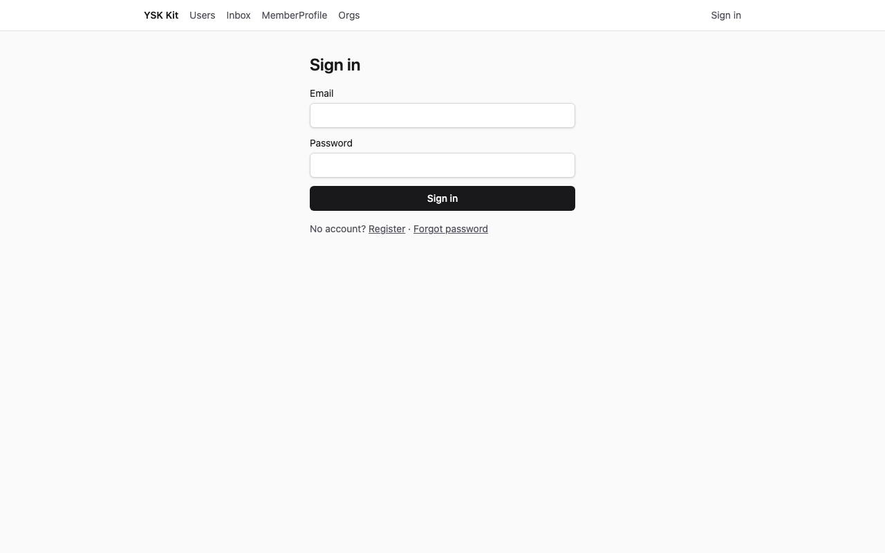
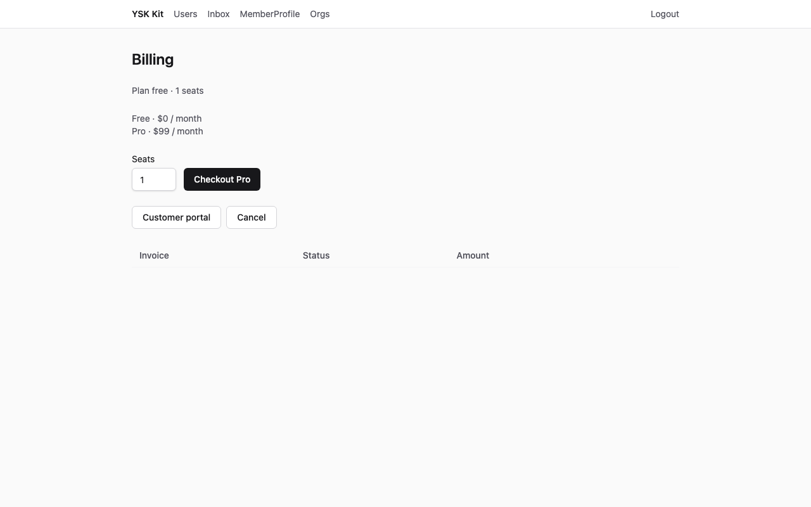
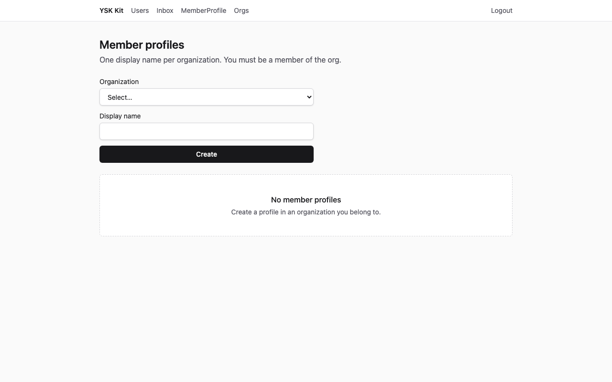
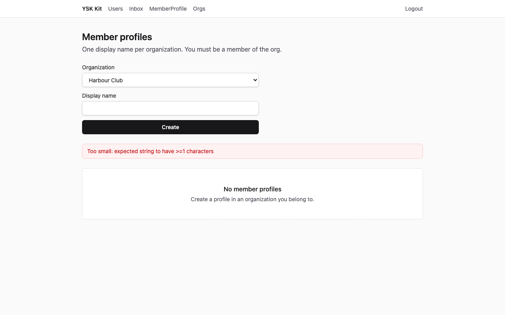
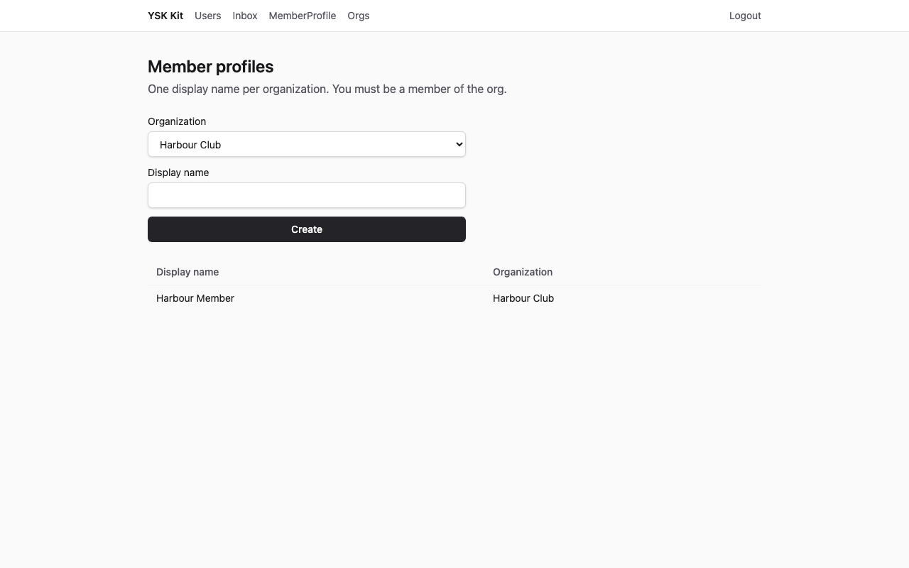
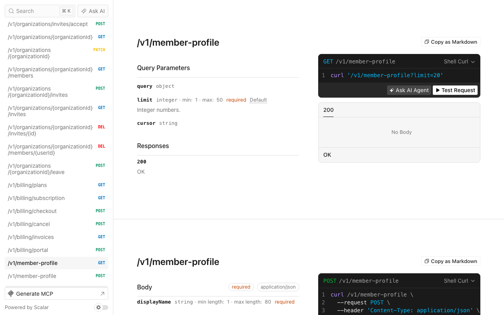

# 會員訂閱

Language: [English](tutorial.md) · 中文

一個 thin SaaS 產品，每個組織一份會員資料，並顯示組織收費。能力清單是 `team` 再 `billing`（套用器已會排這個順序）。

以下截圖為 1280×800，對已套用的目的地擷取（API **13001**，web **15173**）。

## 1. 完成後你會得到甚麼

- 新產品目錄，含 `--preset thin` 的身份、檔案、通知、工作、郵件、API 金鑰、加密與即時通道。
- `ysk add team` 的組織：導航 **Orgs**，標題 **Organizations**，表單標籤 **Name**，按鈕 **Create**。
- `ysk add billing` 的收費：組織詳情對 OWNER／ADMIN 有 **Billing** 連結。方案名稱 **Free** 與 **Pro**。**不要**按 Checkout（會呼叫 `window.location.assign`）。
- 模組 `member-profile`：`GET/POST /v1/member-profile`。列表是作者自己的資料。`(authorId, organizationId)` 唯一。
- 網頁 `/member-profile`（導航 **MemberProfile**）：組織 `<select>` 與 Display name。空白 **No member profiles**。
- 只 seed 帳戶。擷取腳本建立 **Harbour Club**，已登入使用者就是 OWNER。



**預期效果：**登入表單。標題 **Sign in**。

## 2. 誰適用、預計時間

會社、協會，以及任何「組織內具名會籍、可以訂閱」的產品。第一次約 **25–35 分鐘**。

## 3. 前置

- **Node 24** 與 **pnpm 12**
- 此 kit 的 checkout
- 可選：若改 `--db mysql`，需要 Docker MySQL 8.4

## 4. 為甚麼這個 flavor／preset／資料庫

| 選擇 | 值 | 原因 |
|---|---|---|
| Flavor | `saas` | Web + API |
| Preset | `thin` | 十五分鐘路徑。team 與 billing 由 `spec.json` 加入 |
| 資料庫 | `spec.json` 為 sqlite | 不需 Docker。Compose 可傳 `--db mysql` |
| Admin／mobile | 關閉 | 桌面 web 已足夠 |

行業會籍**不會**掛在 living kit API。

## 5. 開倉命令

```bash
pnpm --filter @ysk/examples start apply membership-club --dest ~/Projects/my-club --yes
```

預設目的地（已 gitignore）：`examples/.runs/membership-club`。覆蓋上一次結果請加 `--force`。

手動（sqlite）：`create-ysk-app` thin saas sqlite `--no-admin --no-mobile --yes`，然後 `ysk add team`、`ysk add billing`、`ysk add module member-profile --prisma --web`，複製此 overlay，替換 Prisma 模型 `MemberProfile`，套用 `patches.json`，`prisma db push`，seed。

## 6. 加哪些 module／capability，為甚麼這個順序

`spec.json` 先 `team` 再 `billing`，然後模組 `member-profile`。套用器已會先 team 後 billing。billing 需要組織與會籍，所以 team 必須先存在。行業模組放最後。

`examples/membership-club/patches.json` 會改 memory 測試組裝，讓 `createMemoryMemberProfileRepository(orgs)` 讀與 `organizationService` 同一份會籍。HTTP 測試在同一個 `createApp()` 先建組織再建資料。

## 7. 資料模型

**MemberProfile**（沒有 TypeScript `enum`；沒有連到 Organization 的 Prisma relation）：

| 欄位 | 類型 | 規則 |
|---|---|---|
| `displayName` | 1–80 | 必填 |
| `organizationId` | UUID | 資料所屬組織 |
| `authorId` | UUID | 已登入使用者 |
| 唯一 | `(authorId, organizationId)` | 重複 → `CONFLICT` |

誰可讀寫：已登入使用者列出**自己的**資料。建立時必須是該組織成員。

## 8. 業務規則

1. 非成員建立 → `FORBIDDEN`（HTTP 403），不是 `NOT_FOUND`。
2. 同一作者、同一組織第二份資料 → `CONFLICT`（HTTP 409）。
3. 空白 `displayName` → `VALIDATION_FAILED`（HTTP 422）。
4. 沒有工作階段 → `UNAUTHENTICATED`（HTTP 401）。
5. 列表不需要 `organizationId`；回傳作者的列。

會籍查找與 helpdesk-tickets 相同：Prisma 用 `membership.findUnique` 的 `organizationId_userId`；記憶體倉庫可接受組織倉庫或 `seedMembership`。

## 9. overlay 把哪些檔換成填好的版本

產生器仍用 `title`／`body`。overlay 覆寫 DTO、合約、服務、倉庫、HTTP 測試、Prisma 片段、SDK、web-sdk、頁面與 seed。`app.ts` 與 `router.tsx` 維持 CLI 修補結果（導航 **MemberProfile**，路徑 `/member-profile`）。

## 10. seed 會插入甚麼

| 電郵 | 密碼 | 角色 | 組織／資料 |
|---|---|---|---|
| `admin@ysk.hk` | `ysk-admin-dev` | ADMIN | 沒有 |
| `user@ysk.hk` | `ysk-user-dev` | USER | 沒有 |

## 11. 啟動與登入

```bash
cd ~/Projects/my-club
pnpm dev
```

開啟 http://localhost:5173/login。以 `user@ysk.hk`／`ysk-user-dev` 登入。登入後到 `/users`。在導航開啟 **Orgs**。

## 12. UI 逐步

建立組織：**Name** 填 `Harbour Club`，按 **Create**，等表格文字出現。

在表格按 **Harbour Club** 連結（組織詳情）。擁有人會看到 **Billing**。按 **Billing**。



**預期效果：**標題 **Billing**，方案名稱 **Free** 與 **Pro**。不要按 **Checkout Pro**。

開啟 `/member-profile`（導航 **MemberProfile**）。



**預期效果：**標題 **Member profiles**，空白狀態 **No member profiles**。

Organization 選 **Harbour Club**，Display name 留空，Create。



**預期效果：**警告橫額。

Display name 填 `Harbour Member`，Create。



**預期效果：**一列 **Harbour Member**。

## 13. HTTP 逐步

基底 URL http://localhost:3001（擷取時為 **13001**）。`POST /v1/auth/login` 取得 Bearer。先建立組織。

**預期效果**（`expected/create-ok.json`）：HTTP **201**

```json
{
  "ok": true,
  "data": {
    "displayName": "Harbour Member"
  }
}
```

空白 displayName → HTTP **422** `{ "ok": false, "error": { "code": "VALIDATION_FAILED" } }`。

同一作者、同一組織再 POST → HTTP **409** `CONFLICT`。

第二個使用者向該組織 POST → HTTP **403** `FORBIDDEN`。

沒有 `Authorization` → HTTP **401** `UNAUTHENTICATED`。

未設定 Stripe 金鑰時，log billing adapter 的 checkout URL 見 `expected/checkout-log.json`：

```json
{
  "ok": true,
  "data": {
    "url": "https://billing.local/checkout?plan=pro&seats=1"
  }
}
```

介面不要按 Checkout；billing HTTP 測試已由 `ysk add billing` 覆蓋。

## 14. Scalar `/docs`



**預期效果：**Scalar 列出 `GET`／`POST /v1/member-profile`。`GET /openapi.json` 亦列出 `/v1/organizations` 與 `/v1/billing/plans`。

## 15. 驗證命令

在目的地內：

```bash
pnpm layers && pnpm typecheck && pnpm test && pnpm gen:openapi && pnpm ysk check agent
```

**預期效果：**全部綠色。會員資料測試涵蓋會籍、重複，以及上述 HTTP envelope。`ysk add billing` 的測試仍在目的地內。

## 16. 本例不做甚麼

- 把 `member-profile` 掛進 living kit
- 真實 Stripe checkout 或顧客入口
- Push／流動應用（見 field-work-orders）

## 17. 下一例

課程報名（`course-enrollment`）是 [實例目錄](../README.zh.md) 的下一個系統。
